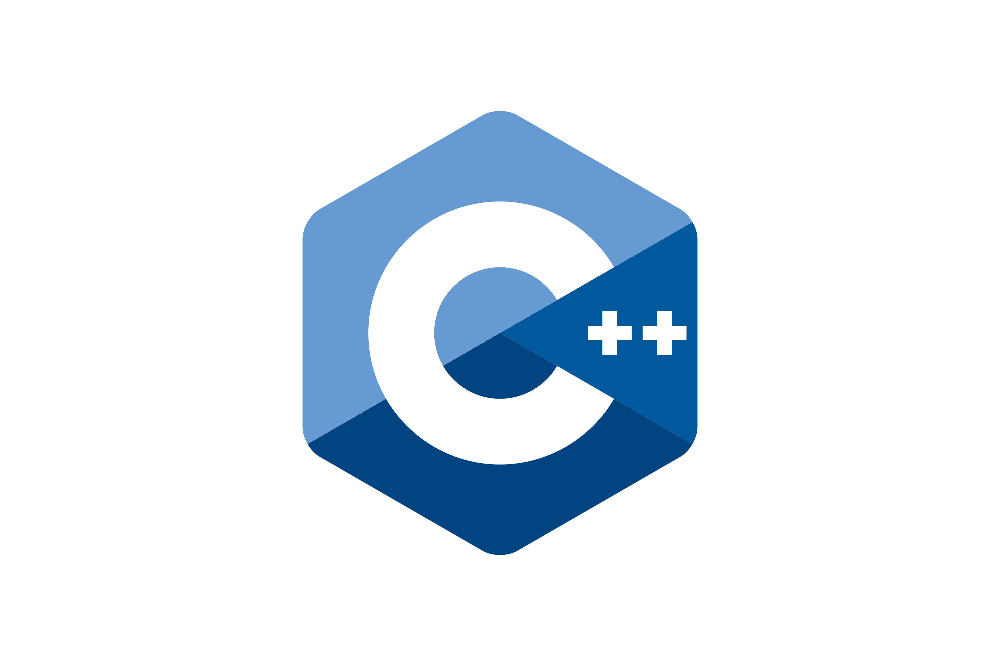
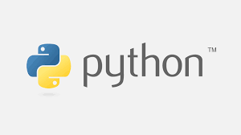
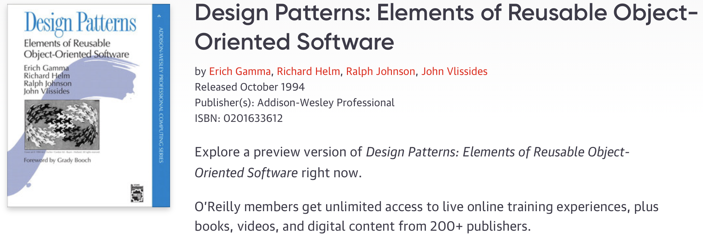

# 디자인 패턴이란 ?

### 디자인 패턴을 왜 배워야할까 ?

> 디자인 패턴은 알고리즘이 아니라 상황에 따라 자주 쓰이는 설계 방법을 정리한 코딩 방법론[나무위키].
> 

> 오랫동안 여러 프로그래밍 문제들을 해결해오며 반복적인 문제들을 타입별로 카테고리화하여 해결방법을 패턴화 한 것.
> 

즉, 디자인 패턴을 익히면 프로그래밍적인 문제들을 장인들의 방법으로 접근하여 보다 쉽게 해결할 수 있다!

또한 디자인 패턴을 익히고 고려하며 코드를 짜면 효율적이며 가독성이 좋고, 재사용성이 높은 코드를 짤 수 있을 것이라 기대한다.

---

### OOP(객체 지향 프로그래밍)란 ?

**객체 지향 프로그래밍**([영어](https://ko.wikipedia.org/wiki/%EC%98%81%EC%96%B4): Object-Oriented Programming, OOP)은 컴퓨터 프로그래밍의 패러다임중 하나이다. 객체 지향 프로그래밍은 컴퓨터 프로그램을 명령어의 목록으로 보는 시각에서 벗어나 여러 개의 독립된 단위, 즉 "객체"들의 모임으로 파악하고자 하는 것이다. 각각의 객체는 메시지를 주고받고, 데이터를 처리할 수 있다.

객체 지향 프로그래밍은 프로그램을 유연하고 변경이 용이하게 만들기 때문에 대규모 소프트웨어 개발에 많이 사용된다. 또한 프로그래밍을 더 배우기 쉽게 하고 소프트웨어 개발과 보수를 간편하게 하며, 보다 직관적인 코드 분석을 가능하게 하는 장점을 갖고 있다. 그러나 지나친 프로그램의 객체화 경향은 실제 세계의 모습을 그대로 반영하지 못한다는 비판을 받기도 한다.[위키피디아](https://ko.wikipedia.org/wiki/객체_지향_프로그래밍)

cf) C언어 : 절차지향적 프로그래밍 ( 함수단위로 순서대로 진행 )

지금은 많은 언어에서 객체 지향 프로그래밍을 적용하고 있지만 과거에는 그렇지 않았다.

### OOP를 한마디로 표현한다면 ?

"객체간의 소통"

### OOP의 특징

- abstraction (추상화)
    - 여러 객체들을 묶어 상위 개념으로 표현 (영희 5000원, 철수 10000원 → 자산)
    - 클래스는 각각의 객체들의 공통된 부분만을 추상화한 것이다.
- Polymorphism (다형성)
    - 어떤 한 요소에 여러 개념을 넣어 놓는 것으로 일반적으로 오버라이딩(같은 이름의 메소드가 여러 클래스에서 다른 기능을 하는 것)이나 오버로딩(같은 이름의 메소드가 인자의 개수나 자료형에 따라서 다른 기능을 하는 것)을 의미한다. 다형 개념을 통해서 프로그램 안의 객체 간의 관계를 조직적으로 나타낼 수 있다.[위키피디아]
    - 인터페이스로 참조, 자식객체, 부모객체
- Encapsulation(캡슐화, 은닉화)
    - 숨길 부분과 밖으로 드러낼 부분을 조절
    - private, public
- Inheritance (상속성)
    - 상속은 새로운 클래스가 기존의 클래스의 자료와 연산을 이용할 수 있게 하는 기능이다. 상속을 받는 새로운 클래스를 부클래스, 파생 클래스, 하위 클래스, 자식 클래스라고 하며 새로운 클래스가 상속하는 기존의 클래스를 기반 클래스, 상위 클래스, 부모 클래스라고 한다. 상속을 통해서 기존의 클래스를 상속받은 하위 클래스를 이용해 프로그램의 요구에 맞추어 클래스를 수정할 수 있고 클래스 간의 종속 관계를 형성함으로써 객체를 조직화할 수 있다.[위키피디아]
    - 자식 객체 생성
    - extends

### OOP의 단점

- 객체지향은 객체와 클래스를 사용하여 각 모듈의 높은 독립성을 권장한다.그래서 여러 클래스를 상속해서 사용해 중복코드를 최소화하고, 유지보수확장성을 높입니다. -> 실행 속도가 느리다.
- 객체가 많으면 메모리 비효율적으로 차지.
- 설계에 오랜 시간 걸림.
- 설계 실패 시 리스크 큼.

---

### OOP는 디자인 패턴과 무슨 관계가 있는가 ?

디자인 패턴은 객체 지향 프로그래밍 설계를 할 때 자주 발생하는 문제들을 피하기 위해 사용되는 패턴[나무위키]이다. 왜 OOP인가 ?  

사실 디자인 패턴은 어떠한 프로그래밍 방법론에도 적용될 수 있으며 심지어 프로그래밍 방법론을 넘어 다양한 분야에서 사용될 수 있다.

소프트웨어 분야에서 디자인 패턴이라는 용어가 유명해진 계기는 GOF, **Design Patterns: Elements of Reusable Object-Oriented Software** 라는 책이 출판되면서 부터이다. 책의 제목에서 유추할 수 있듯이 이 책에서 제안하는 디자인 패턴들은 가독성 및 효율성 뿐만 아니라 OOP에서 코드의 재사용성을 높이는 것을 고려하여 패턴화 하였다.

즉, 프로그래밍분야의 디자인 패턴의 틀을 만들었다고 할 수 있는 이 책에서 디자인 패턴은 OOP 프로그래밍 방식과 아주 잘 어울리는 개념이라 할 수 있다.

위에서 언급한 책에서 패턴을 크게 3가지로 나누는데 다음과 같으며 각 패턴은 모두 "객체"와 연관이 있다.

생성(creational) 패턴 : 객체의 생성에 대한 방법들

구조(structural) 패턴 : 객체와 객체 사이의 상속/조합 관계설정 방법들

행위(behavioral) 패턴 : 객체가 특정 행동을 함으로서 다른 객체에 값을 전달하는 방법들