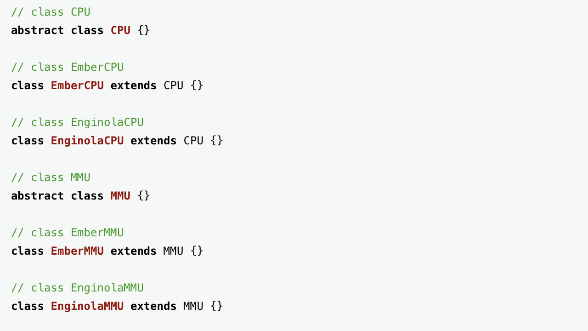
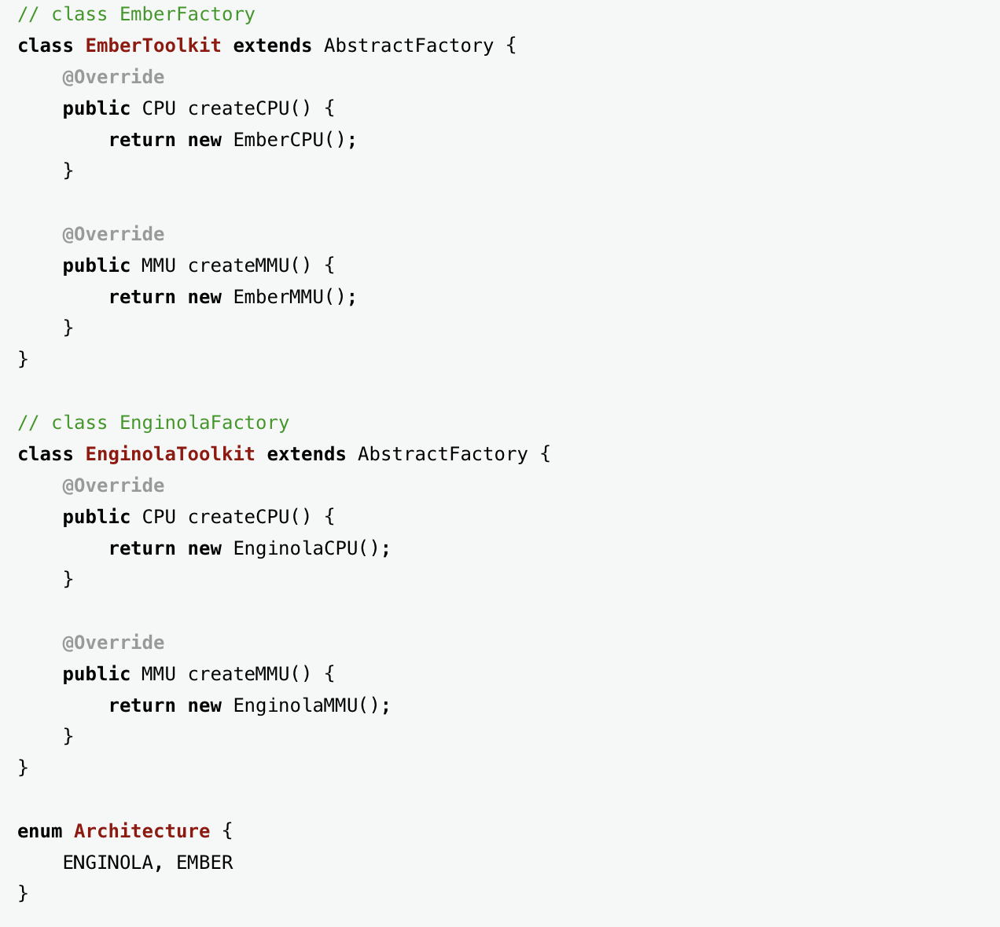
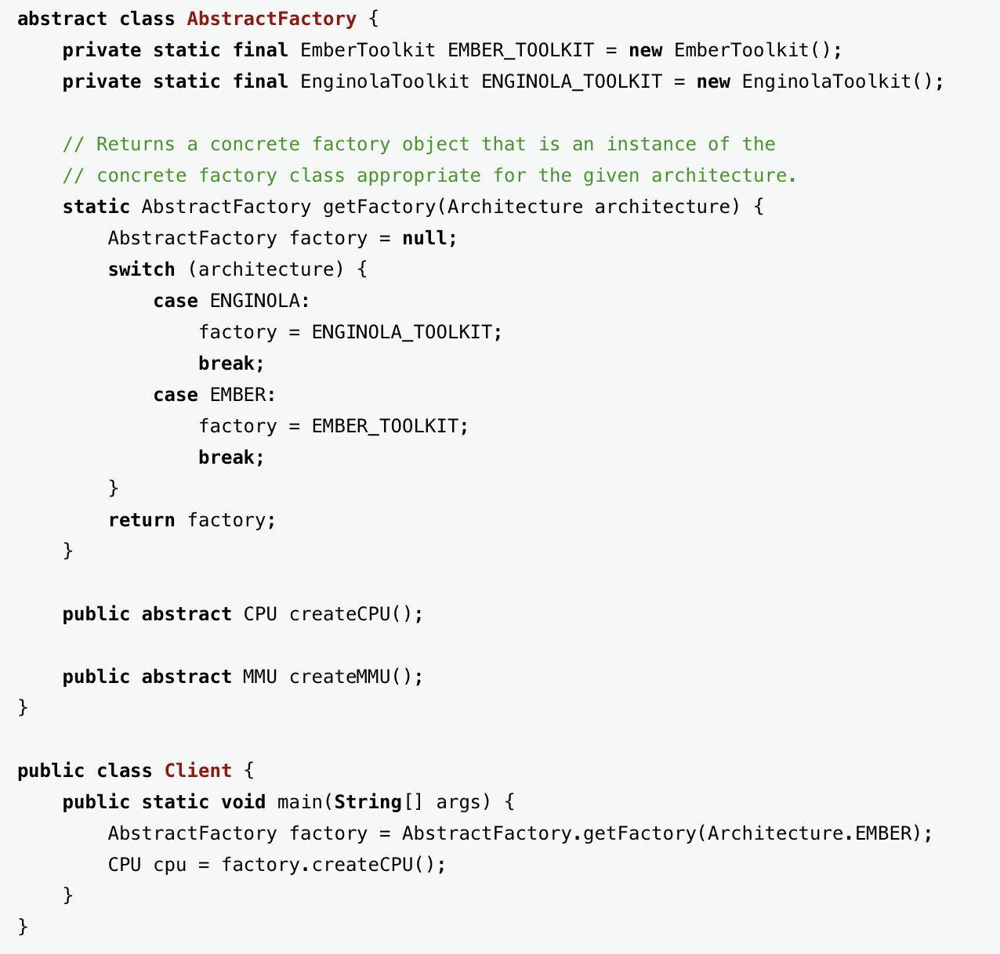
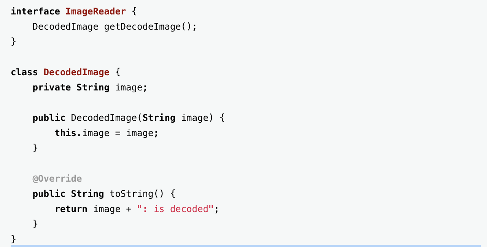
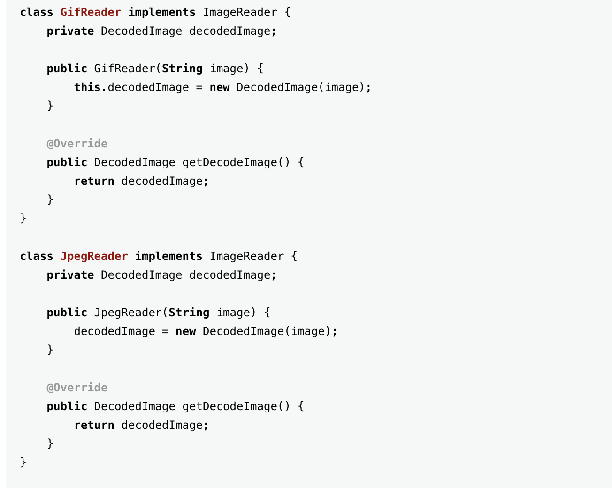
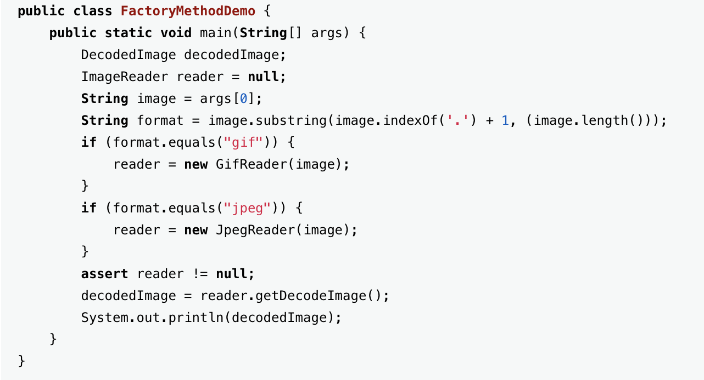
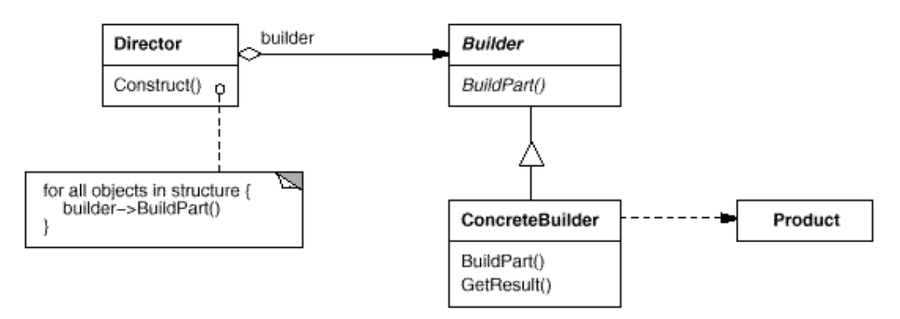

# Creational Pattern

## Creational Pattern

- 생성 패턴은 인스턴스를 만드는 절차를 **추상화**하는 패턴입니다.
- 객체를 생성, 합성하는 방법이나 객체의 표현 방법과 시스템(소프트웨어)(user)을 분리해 줍니다.

---

- 생성 패턴은 시스템이 어떤 구체 클래스를 사용하는지에 대한 정보를 **캡슐화**합니다.
- 생성 패턴은 이들 클래스의 인스턴스들이 어떻게 만들고 어떻게 서로 맞붙는지에 대한 부분을 완전히 가려줍니다.

→ 생성 패턴을 이용하면 무엇이 생성되고, 누가 이것을 생성하며, 이것이 어떻게 생성되는지, 언제 생성할 것인지 결정하는 데 유연성을 확보할 수 있게 됩니다.

---

- 생성 패턴으로 분류되는 패턴은 여러 개인데, 이런 여러 생성 패턴들은 서로 보완적일 수도 있고 선택되기 위해 서로 경쟁적일 수도 있습니다. 즉, 동일한 문제 해결을 위해서 어떤 생성 패턴을 사용해야 할지 결정을 내리기 어렵습니다.
- 생성 패턴 간에는 매우 밀접한 관련성이 있습니다. (어떠한 패턴을 구현하는데 다른 패턴을 이용)

## Abstract Factory

<aside>
💡 구체적인 클래스를 지정하지 않고 관련성을 갖는 객체들의 **집합**을 생성하거나 서로 독립적인 객체들의 **집합**을 생성할 수 있는 **인터페이스**를 제공하는 패턴입니다.

</aside>

---

### 활용성

- 객체가 생성되거나 구성, 표현되는 방식과 무관하게 시스템을 독립적으로 만들고자 할 때
- 여러 제품군 중 하나를 선택해서 시스템을 설정해야 하고 한번 구성한 제품을 다른 것으로 대체할 수 있을 때
- 관련된 제품 객체들이 함께 사용되도록 설계되었고, 이 부분에 대한 제약이 외부에도 지켜지도록 하고 싶을 때
- 제품에 대한 클래스 라이브러리를 제공하고, 그들의 구현이 아닌 인터페이스를 노출시키고 싶을 때

→ 여기서 말하는 제품은 특정 product (예제에서는 CPU, MMU)

---

### 예제 [ Java ]

CPU, MMU 객체는 기존에 존재.

EMBERToolKit, EnginolaToolKit 과같은 생성할 객체의 클래스는 캡슐화 되어 사용자로부터 분리되었습니다.

(toolkit class → abstract factory → user)

- abstract factory(AbstractFactory): 개념적 제품에 대한 객체를 생성하는 연산으로 **인터페이스**를 정의합니다.
- Concrete factory(EnginolaToolKit, EmberToolKit): 구체적인 제품에 대한 객체를 생성하는 연산을 구현합니다.
- AbstractProduct(CPU, MMU): 개념적 제품 객체에 대한 인터페이스를 정의합니다.
- ConcreteProduct(EmberCPU, EmberMMU, EnginolaCPU, EnginolaMMU): 구체적으로 팩토리가 생성할 객체를 정의하고, AbstractProduct가 정의하는 인터페이스를 구현합니다.
- Client: AbstractFactory와 AbstractProduct 클래스에 선언된 인터페이스를 사용합니다.

출처 : [Design Patterns and Refactoring](https://sourcemaking.com/design_patterns/abstract_factory/java/1)

---

### Abstract factory 패턴을 사용함으로써 얻는 이익과 부담.

- 구체적인 클래스(concrete class)를 분리합니다.
- 제품군을 쉽게 대체할 수 있도록 합니다.
- 제품 사이의 일관성을 증진시킵니다.
- 새로운 종류의 제품을 제공하기 어렵습니다.

→ 여기서 말하는 제품은 특정 product (예제에서는 CPU, MMU)

---

### 관련패턴

AbstractFactory 클래스는 **factory method** 패턴을 이용해서 구현되는데, **prototype 패턴**을 이용할 때도 있습니다. concrete 팩토리는 **singleton 패턴**을 이용해 구현하는 경우가 많습니다.

## Factory Method

<aside>
💡 객체를 생성하는 인터페이스는 미리 정의하되, 인스턴스를 만들 클래스의 결정은 **서브클래스** 쪽에서 내리는 패턴입니다. 팩토리 메서드 패턴에서는 클래스의 인스턴스를 만드는 시점을 서브클래스로 미룹니다.

</aside>

---

### 활용성

- 어떤 클래스가 자신이 생성해야 하는 객체의 클래스를 미리 예측할 수 없을 때
- 생성할 객체를 기술하는 책임을 자신의 서브클래스가 지정했으면 할 때
- 객체 생성의 책임을 몇 개의 보조 서브클래스 가운데 하나에게 위임하고, 어떤 서브클래스가 위임자인지에 대한 정보를 국소화시키고 싶을 때

---

### 예제[ Java ]

- Product(ImageReader) : 팩토리 메서드가 생성하는 객체의 인터페이스를 정의합니다.
- ConcreteProduct(GifReader, JpegReader): Product 클래스에 정의된 인터페이스를 실제로 구현합니다.
- Creater(FactoryMethodDemo): Product 타입의 객체를 반환하는 팩토리 메서드를 선언합니다. Creater  클래스는 팩토리 메서드를 기본적으로 구현하는데, 이 구현에서는 ConcreteProduct 객체를 반환합니다. 또한 Product 객체의 생성을 위해 팩토리 메서드를 호출합니다.
- ConcreteCreator(): 팩토리 메서드를 재정의하여 ConcreteProduct의 인스턴스를 반환합니다.

예제에서는 **getDecodedImage**가 **factory method**가 됩니다. 왜냐하면 객체를 제조하는 방법을 알기 때문입니다.

출처 : [Design Patterns and Refactoring](https://sourcemaking.com/design_patterns/factory_method/java/1)

---

### 관련 패턴

- abstract factory 패턴은 이 factory method를 이용하여 구현할 때가 많습니다.
- 팩토리 메서드는 템플릿 메서드 패턴에서도 사용될 때가 많습니다.

---

## Builder

복합 객체의 생성 과정과 표현 방법을 분리하여 동일한 생성 절차에서 서로 다른 표현 결과를 만들 수 있게 하는 패턴입니다.

<aside>
💡 객체

단일 객체 : 하나의 클래스로 생성된 객체 ( 객체는 데이터와 행동(메소드)를 가짐.)

복합 객체 : 하나의 객체가 다른 객체를 포함하는 관계 구조를 가지는 객체

</aside>

활용성

- 복합 객체의 "생성 알고리즘"이 이를 합성하는 요소 객체들이 무엇인지 이들의 "조립 방법"에 독립적일 때
- 합성할 객체들의 표현이 서로 다르더라도 생성 절차에서 이를 지원해야 할 때

참여자

- Builder: Product 객체의 일부 요소들을 생성하기 위한 추상인터페이스를 정의합니다.
- ConcreteBuilder: Builder 클래스에 정의된 인터페이스를 구현하며, 제품의 부품들을 모아 빌더를 복합합니다. 생성한 요소의 표현을 정의하고 관리합니다. 또한 제품을 검색하는데 필요한 인터페이스를 제공합니다. ( 여기에 구체적인 복합 객체의 생성 방식이 지정됨.)
- Director: Builder 인터페이스를 사용하는 객체를 표현합니다. ( 인스턴스 사용)
- Product: 생성할 복합 객체를 표현합니다. ( 제품의 속성, 기능등을 가짐.)

Director 객체를 생성하고, 생성한 객체를 자신이 원하는 Builder 객체로 합성해 나갑니다.

Product가 구축될 때마다 Director는 Builder에 통보합니다.

Builder는 Director의 요청을 처리하여 제품에 부품을 추가합니다.

사용자는 Builder에서 제품을 검색합니다.

예제

결과

- 제품(Product)에 대한 내부 표현을 다양하게 변화할 수 있습니다.
- 생성과 표현에 필요한 코드를 분리합니다.
- 복합 객체를 생성하는 절차를 좀더 세밀하게 나눌 수 있습니다.

관련 패턴

복잡한 객체를 생성해야 할 때 '추상 팩토리 패턴'은 '빌더 패턴'과 비슷한 모습을 보입니다. 근본적인 차이가 있다면 빌더 패턴은 복잡한 객체의 단계별 생성에 중점을 둔 반면, 추상 팩토리 패턴은 제품의 유사군들이 존재할 때 유연한 설계에 중점을 둔다는 것입니다. 빌더 패턴은 생성의 마지막 단계에서 생성한 제품을 반환하는 반면, 추상 팩토리 패턴에서는 만드는 즉시 제품을 반환합니다. 추상 팩토리 패턴에서 만드는 제품은 꼭 모여야만 의미 있는 것이 아니라 하나만으로도 의미가 있기 때문입니다.

### Prototype

### Singleton

---

### 참고 자료

[1] GoF의 디자인 패턴

[2] [https://sourcemaking.com](https://sourcemaking.com/)