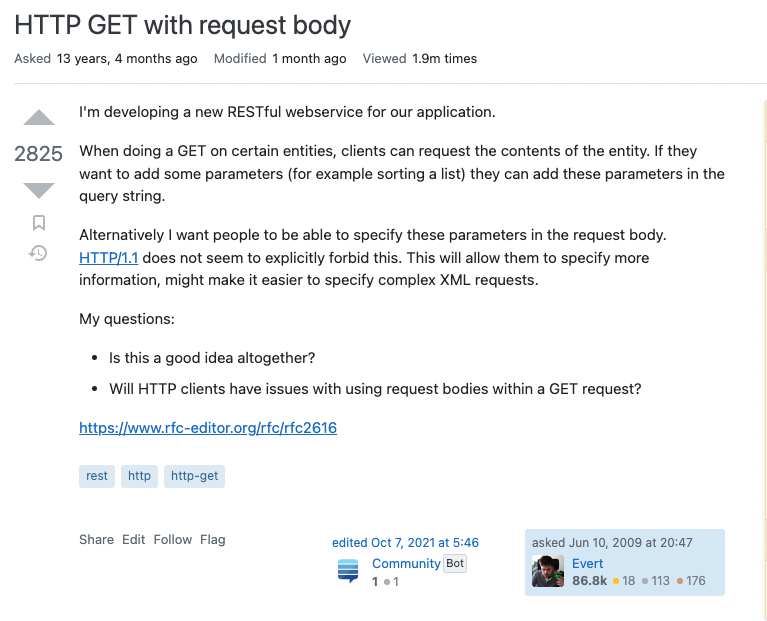
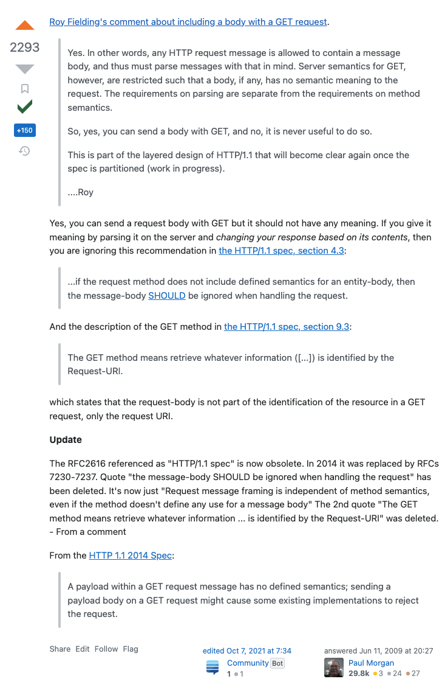
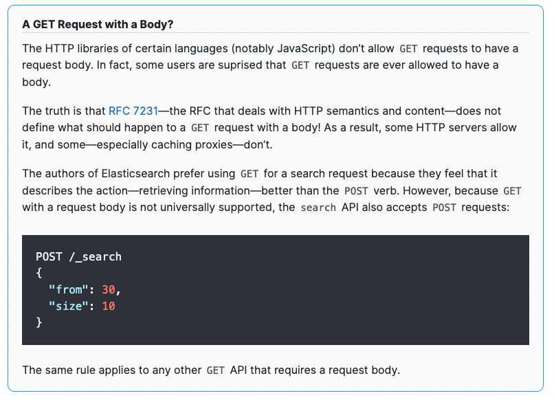
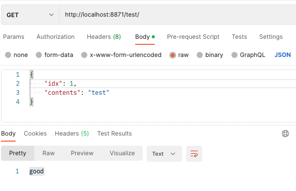

# 10월 9일의 깨달음

주말마다 감사하게도 온라인 스터디를 진행하고 있다.

이번 스터디에서 기본적이지만 평소에 생각해보지 않았던 것이 생겨 글로 당시의 깨달음을 남긴다.

구현된 API중에 GET Method로 정보를 요청하는 API가 있다. 해당 API는 요청 파라미터로 4가지의 파라미터를 필요로한다.

나는 문득 생각이 들었고 해당 코드에 리뷰를 남겼다.

“4가지 값들을 파라미터로 받는 이유가 있을까요?”

해당 리뷰를 남긴 이유는 경로 파라미터로 4가지를 넘겨주는 것보다는 body로 넘겨주는 것이 낫지 않을까? 하는 생각이 들었기 때문이다.

여기서 팀원분들의 의견을 듣다가 알게된, 내가 잊고 있었던 개념이 있다.

관례적으로 GET Method는 Body를 사용하지 않는다는 것이다.

(웹 개발자로 진로를 준비하던 오래되지 않은 과거에 이러한 개념을 공부했던 기억이 났다..ㅋㅋ

POST와 GET의 차이는 무엇인가요 ? → POST는 body에 데이터를 담고, GET은 uri에 담는다. GET은 url에 데이터가 바로 드러나며 POST는 바로 드러나지는 않지만 Client가 확인할 수 있기에 보안상 데이터 암호화가 필요하면 둘다 해야한다..와 같은 기억이 새록새록)

### 음..그런데 GET 요청, 즉 어떠한 데이터를 조회하기 위한 목적이지만 body에 값을 담아주는 것이 더 적합하거나 효율적인 상황이 있을 수 있지 않을까 ?

[stackoverflow](https://stackoverflow.com/questions/978061/http-get-with-request-body)에서  GET메소드에 body를 사용하는 것에 대해 많은 사람들이 함께 고민을한 흔적들을 볼 수 있었다.

질문글을 요약하면 다음과 같다.

‘어플리케이션을 위한 새로운 RestFul 웹서비스를 만들고 있다. 특정 Entity들을 얻기위한 GET동작 API를  만들고 있으며 나는 GET요청을 위해 사용되는 parameter를 reqeust body에 담아 요청할 수 있게 하고 싶다. HTTP/1.1에서는 이를 금지하고 있지 않는 것으로 보인다. 이러한 방법(body에 parameter를 담는 것)은 더욱 명확한 요청을 할 수 있게 하고 복잡한 XML 요청을 쉽게 할 것이다.’

채택된 답변을 내용을 보면 간략하게 다음과 같다.

‘HTTP/1.1 문서를 보면 “그러한 방법을 권장하지 않는다.”,  “GET 메소드는 “URI를 통한 요청”으로 정보를 얻는 것을 의미한다.”와 같은 내용이 있다. 즉 GET으로 바디에 값을 담아 요청을 하는 것이 가능은 하지만 바디의 값은 어떠한 의미도 갖지 않는다.’

그리고 해당 답변에 업데이트된 내용이 있다. 2014년도 HTTP/1.1 문서에서는 앞서 말한 문서의 내용이 삭제 되었고, 요청 데이터를 담는 것은 메소드의 의미론과는 독립적인 개념이라는 내용으로 대체되었다는 내용이다.

그리고 부가적인 코멘트의 내용들 중 elasticsearch는 GET요청시 body에 data를 담아 전달하는 대표적인 프로덕트라는 내용이 있었다.

elasticsearch Getting Started 문서를 보면 다음과 같은 내용을 확인할 수 있다.

요약 :  RFC 문서에 따로 GET메소드에 body를 사용하는 것에 대한 제약조건이 없기 때문에  사용할 수 없는 것은 아니며, elasticseach 관리자는 body를 사용하더라도 의미적으로 정보를 조회하기 때문에 GET 메소드를 사용하는 것을 선호한다. 다만 언어적으로 GET메소드에 body를 담는 것을 허용하지 않는 언어들이 있기 때문에 POST또한 당연히 지원을 한다. 가령 javascript의 http 라이브러리는 해당 방식을 허용하지 않는다.

Spring에서 테스트를 해보니 GET 요청 시 body에 값을 담아보내고 @RequestBody로 값을 받을 경우 별도의 예외처리가 되어있지 않다.

[stackoverflow](https://stackoverflow.com/questions/34956899/does-spring-requestbody-support-the-get-method) 해당 내용을 보면 SpringMVC에서도 과거에는 해당 방법을 허용하지 않았던 것 같다. v5.3.6(spring)이후로 GET 요청에 body에 데이터를 담아 보내는 것을 허용했다는 코멘트는 확일할 수 있다.

### 결론

2014년도를 기점으로 HTTP 문서에서 메소드정의와 데이터 요청 처리 방법은 별개의 개념이라는 것을 명시하였다.

elasticsearch는 GET 메소드에 body를 사용하는 것을 권장한다.

하지만 소위 말하는 RestFul하게, HTTP Spec을 준수하여(지금은 HTTP Spec에 관련 내용은 삭제되었지만) 예전부터 관례적으로 룰을 정해 사용해왔기 때문에 이러한 설계 규칙을 벗어나는 것은 함께하는 공동체의 동의 및 부수적인 고민들이 필요할 것이다.