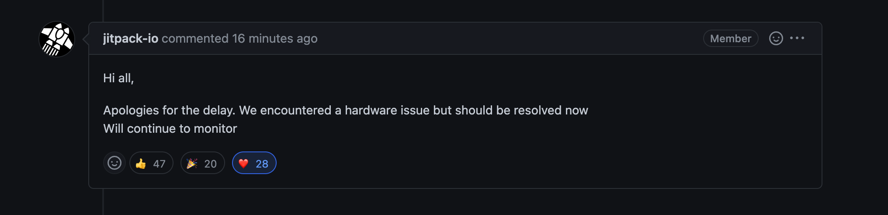

# 2022년 12월 23일의 깨달음

나는 현재 회사에서 혼자 개발하고 있다. 

오늘은 내가 담당하고 있는 프로젝트가 사실은 나 혼자 개발하고 있는 프로젝트가 아니라는 깨달음을 준 사건을 기록하고자 한다.

문제는 어제 저녁에 발생했다. 쿠폰 기능 출시가 코 앞으로 다가왔고, 빠른 테스트 → 수정 → 반영의 반복이 스테이징 환경에서 이뤄지고 있는 상황이었다. 

그런데 갑자기 스테이징 환경으로의 github action 배포과정에서 gradle build에서 실패를 반복해서 하는 것이다.

로그는 iamport-rest-client-java 라이브러리를 해결할 수 없다는 문구였다.

마침 또 아임포트 스테이징용 계정을 새로만들어 적용하는 시점에 발생한 에러였기에 뭔가 아임포트 관련해서 문제가 있으리라 짐작하였고, 라이브러리 버전이 최신 버전이 아니었기 때문에 해당 버전을 최신 버전으로 올렸더니 잘 배포가 되었다.

그러고 작업이 남아 집에서 다시 다른 브랜치(새로 만든 아임포트 계정을 반영하지 않은 브랜치)로 배포를 진행했는데 동일한 로그로 배포에 실패하는 것이다..! 

뭔가 잘못됬음을 느꼈다. 이 후에 해당 브랜치도 아임포트 라이브러리의 버전을 변경해보았고 변경해도 실패하였다. 

이후로 여러가지 원인분석을 하였는데, 결론은 상황에 관계없이 규칙적이지 않은 결과를 보였다. (배포가 실패하고 성공하는 기준이 규칙성이 전혀없음.)

오늘 아침에 기존에 같은 팀에 계셨던 사수께 양해를 구하고 허들을 요청했다. (젠틀하고 명석하신 분이시다.)

함께 원인을 파악하다보니 발견한 엄청난 사실.. iamport라이브러리는 jitpack이라는 서비스에서 관리되었고 해당 jitpack api 들이 다 다운 된 것이다.

또 공교롭게도 해당 서비스를 담당하는 개발자 분들은 휴가신 것 같았다.

아임포트 개발자분들께 해당 상황을 문의드렸고, 전 세계적으로 동일한 문제이며 해당 회사에서도 대응을 기다리고 있다는 답..

다른 팀의 개발자분의 조언으로 아임포트라이브러리를 내장 라이브러리로 프로젝트에 삽입하고 연결하여 해결은 하였지만, 정말 벙찐 순간이었다.

이번 사건을 계기로 내가 짠 코드에 옆에는 없지만 많은 개발자분들이 함께 작업하고 있다는 것을 느꼈다.

동지들

홀리

다행히 잘 해결됨ㅎㅎ

