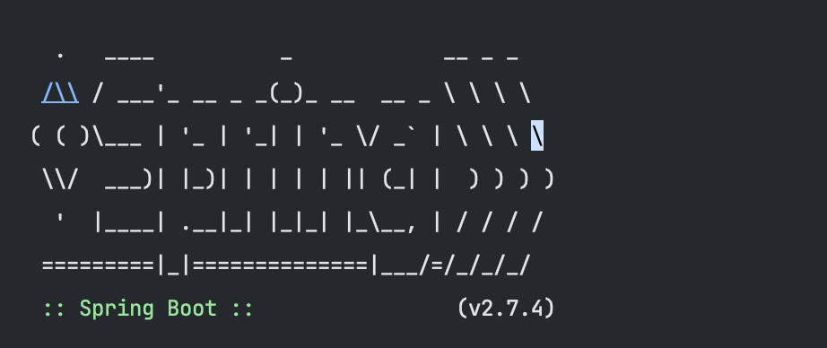

오랜만에 김영한님의 자바 orm 표준 JPA프로그래밍 책을 꺼내서 코드를 따라치고, 서버를 실행했는데 오랜만에 봐서 반가운( 현재 회사에서 nest를 사용 중 )로고를 보여줬는데, 문제는 다음 로그를 보여주지 않았다.

얼른 실행시켜서 확인하고 책을 다음장으로 넘어가고 싶은데 서버가 실행이 안된다.

알고보니 라이브러리의 버전 문제였다. 스프링 부트는 라이브러리의 의존성 버전을 자동으로 맞춰주는데 이 때 충돌이 발생한 것이다.

각 라이브러리의 버전 명시를 제외함으로써 해결.