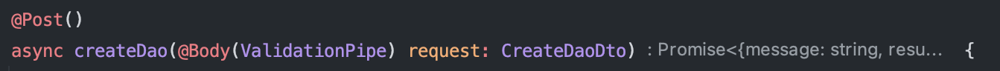
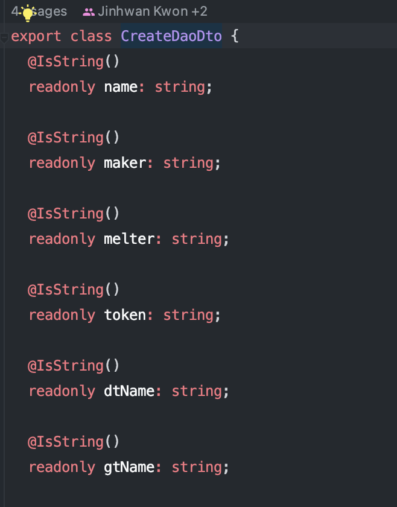
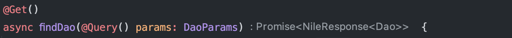
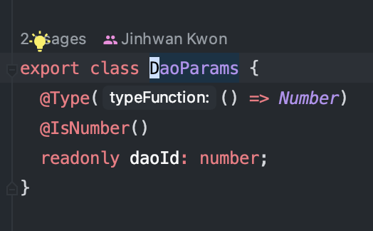

우리 팀은 NestJS로 서버개발을 하고 있는데, 초반에 nest를 학습하면서 Spring과 아주 비슷해서 어느 순간부터 nest 학습을 안하다가, 몰랐던 개념을 알게되어 기록한다.

이름하여 Pipe.

- 파이프는 보통 2가지의 목적을 위해 사용된다.
  1. validation(유효성 검사) - 클라이언트가 전달한 데이터가 유효한지 검사 및 예외 처리.
  2. transformation(변환) - 클라이언트가 전달한 데이터를 원하는 타입으로 변환.

- 해당 처리 시점은 라우터 핸들러로 전달되기 전.

- class-validator와 class-transformer 라이브러리와 함께 사용하면 더욱 편리하게 유효성 검사와 변환이 가능합니다.

- 프로젝트에서 사용되는 부분

1. @Body, @Query, @Param등의 어노테이션에 인자값으로 Pipe를 넣어주면 handler 단위로 파이프를 설정할 수 있습니다.

2. CreateDaoDto를 살펴보면 @IsString() 등의 class-validator 데코레이터로 파이프가 유효성 검사의 목적으로 사용되는 것을 확인할 수 있습니다.

3. 프로젝트 단위로 main.ts 파일을 보면 useGlobalPipes메소드로 특정 Pipe를 전역적으로 설정할 수도 있습니다. transfrom: true를 옵션으로하여 생성해주어야 class-transformer 라이브러리 적용이 가능합니다.

4. 쿼리 파라미터의 타입으로 활용되는 DaoParams를 살펴보면 class-transformer의 @Type 데코레이터로 전달받은 값을 Number 타입으로 변환하여 변환의 목적으로 사용되는 것을 확인할 수 있습니다.