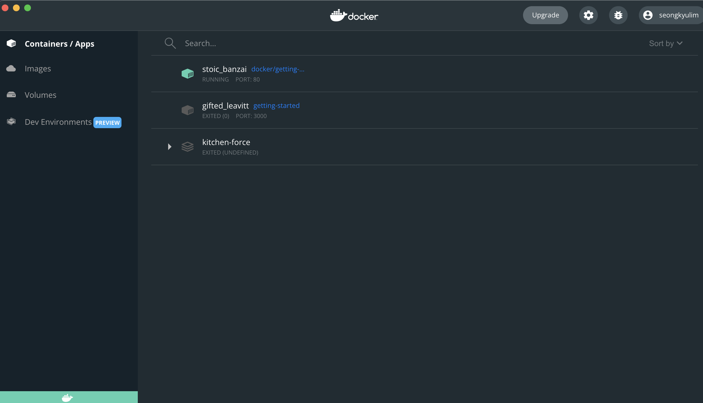
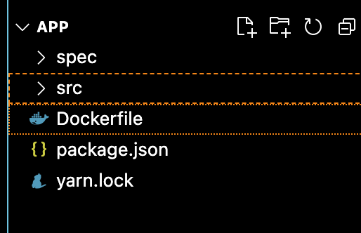
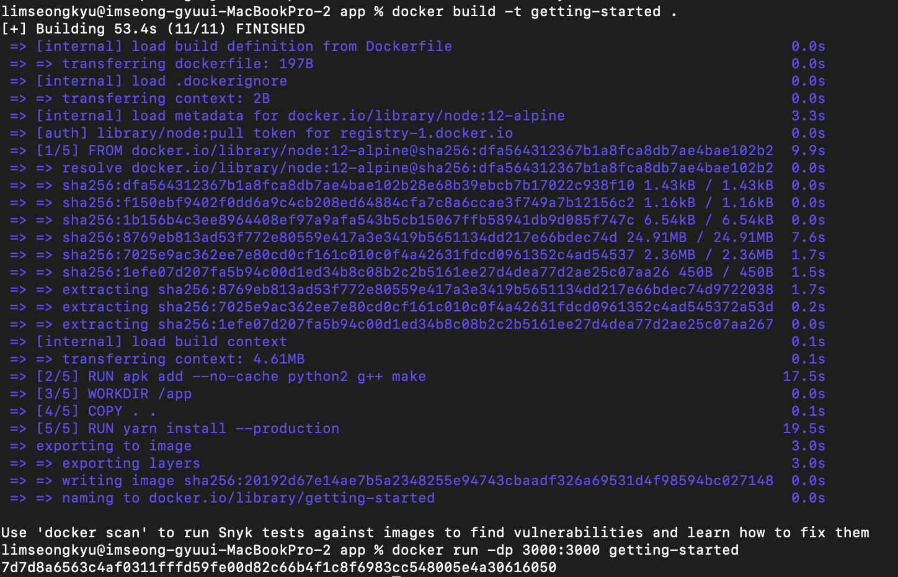
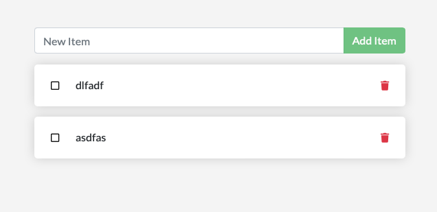
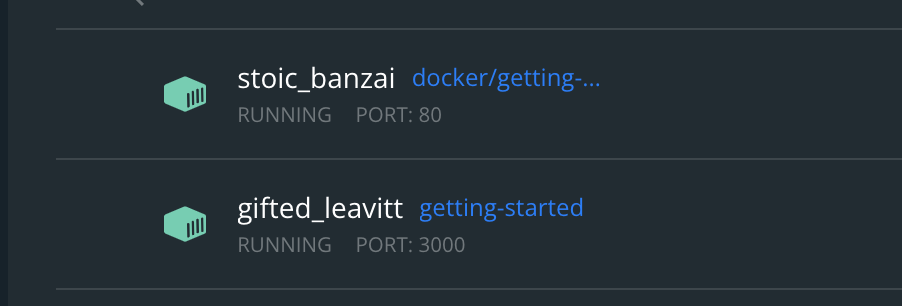

# <span style={{color: '#4fddbf'}}>Get Started</span>

현재 기획 중인 프로젝트에 도커를 적용하기위해 도커 공부를 시작합니다. Docker의 공식 문서가 아주 깔끔하게 잘 정리되어있으며 필자는 처음 시작하기 때문에 Get started 튜토리얼을 따라해보고 정리해 보았습니다.

해당 튜토리얼에서 배우는 것은 다음과 같습니다.

- <span style={{color: '#ff7f00'}}>Build</span> and <span style={{color: '#ff7f00'}}>run</span> an <span style={{color: '#ff00ff'}}>image</span> as a <span style={{color: '#ff00ff'}}>container</span>
- <span style={{color: '#ff7f00'}}>Share</span> images using <span style={{color: '#ff00ff'}}>Docker Hub</span>
- <span style={{color: '#ff7f00'}}>Deploy</span> <span style={{color: '#ff00ff'}}>Docker applications</span> using multiple containers with a database
- <span style={{color: '#ff7f00'}}>Running</span> applications using <span style={{color: '#ff00ff'}}>Docker Compose</span>

## Get Started

우선 자신의 로컬 OS에 맞는 Docker를 설치해 줍니다. Docker사이트에서 간단하게 설치가 가능합니다.

설치가 완료되었다면 간단하게 도커 공식문서를 컨테이너화하여 실행시켜 보겠습니다.

```docker
docker run -d -p 80:80 docker/getting-started
```

docker 명령어 한 줄로 이미지를 쉽게 실행 시킬 수 있습니다.

설치한 Docker을 실행한뒤 dashboard를 확인해보면 아래와 같이 해당 컨테이너가 실행 중인 것을 확인할 수 있습니다.



### 컨테이너란 ?

컨테이너는 로컬에서 돌아가고 있는 하나의 프로세스이지만 로컬의 다른 프로세스들과 완전히 격리되어있는 프로세스입니다. 도커는 이러한 격리 기능을 사용하기 쉽게 만들기위해 노력해오고 있습니다. 좀 더 자세히 정리하자면,

- 컨테이너는 이미지의 실행가능한 인스턴스입니다. DockerAPI 또는 CLI를 사용하여 컨테이너를 생성하거나 시작하거나, 멈추거나 삭제하는 것이 가능합니다.
- 로컬 머신, 가상머신, 배포된 클라우드 환경에서 실행가능합니다.
- 어떤 OS에서도 실행 가능합니다.
- 컨테이너는 서로 격리되어있습니다. 따라서 각 컨테이너는 자신만의 software, binaries, configuration을 가집니다.

### 컨테이너 이미지란 ?

컨테이너는 다른 모든 프로세스와 격리되어있습니다. 따라서 컨테이너는 자신만의 파일 시스템을 사용합니다. 이러한 custom filesystem이  컨테이너 이미지에 의해 제공됩니다. 이미지는 컨테이너의 파일시스템을 가지고있기 때문에 어플리케이션을 실행하기위한 모든것을 가지고 있어야합니다.( all dependencies, configuration, scripts, binaries, etc.) 또한 컨테이너를 위한 다른 configuration들도 가지고 있습니다.(environment variables, a default command to run, and other metadata.)

---

## Sample Application

이제 도커에서 제공하는 샘플 어플리케이션을 컨테이너를 통해 실행시켜 보겠습니다. 예제에서 사용하는 어플리케이션은 node.js기반의 to-do list 어플리케이션입니다.

[https://github.com/docker/getting-started/tree/master/app](https://github.com/docker/getting-started/tree/master/app) 에서 레포지토리를 클론 받아 해당 app 폴더만 분리하여 사용할 수 있습니다.

해당 폴더를 vscode와 같은 ide를 통해 열고 DockerfIle을 생성해 줍니다. 이때 주의할 점은 Dockerfile은 .txt와 같은 확장자를 붙여서는 안됩니다.



application을 빌드하기위해 도커파일을 사용합니다. 도커파일은 간단한 문자 기반 스크립트이며 컨테이너 이미지를 생성해줍니다.

```
# syntax=docker/dockerfile:1
FROM node:12-alpine
RUN apk add --no-cache python2 g++ make
WORKDIR /app
COPY . .
RUN yarn install --production
CMD ["node", "src/index.js"]
EXPOSE 3000
```

이제 어플리케이션을 빌드해주기위해 터미널을 키고 해당 어플리케이션의 위치에서 아래의 도커 빌드 명령어를 쳐줍니다.

```docker
 docker build -t getting-started .
```

이제 dockerfile안의 내용을 통해 새로운 컨테이너 이미지가 생성됩니다. 아래와 같이 많은 layers들이 생성되는데, dockerfile에서 node:12-alpine 이미지로부터 시작하도록 설정하였지만 해당 컨테이너에는 존재하지 않기 때문에 다운로드 하는 것입니다.



빌드가 완료되었다면 이제 이미지는 생성이되었고, 해당 어플리케이션을 아래 명령어를 통해 실행시켜보겠습니다.

```docker
 docker run -dp 3000:3000 getting-started
```

도커파일에 설정한 로컬 3000포트로 접속을 하면 정상적으로 어플리케이션이 실행된 것을 확인할 수 있습니다.

[http://localhost:3000](http://localhost:3000/)



또한 도커 대쉬보드에 들어가면 실행 명령어로 인해 컨테이너가 실행되고 있는 것을 확인할 수 있습니다. 현재 맨 처음 실행한 컨테이너를 포함하여 두개의 컨테이너가 실행 중인 것을 확인할 수 있습니다.



<aside>
👏🏼 Dockerfile하나로 도커관련한 설정을 마치고 빌드 및 실행 명령어 두줄로 어플리케이션에 도커를 적용할 수 있습니다. 정말 간단하죠?!

</aside>

Docker 공식 문서 : [https://docs.docker.com/get-started/](https://docs.docker.com/get-started/)