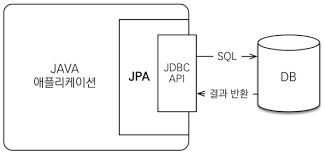

# JPA 소개

글을 작성하기에 앞서 JPA 학습은 김영한님이 쓰신 ‘자바 ORM 표준 JPA 프로그래밍’책을 통해 이루어졌음을 알려드립니다.

JPA를 알기위해서는 우선 ORM이라는 개념을 알아야합니다.

서버에서 데이터베이스에 접근하여 데이터들을 다루기위한 여러 기술들이 존재합니다. 그 중하나가 ORM(object-relational-mapping)으로, 객체와 관계형 데이터베이스의 패러다임의 차이를 없애주어 데이터베이스를 다루는 것도 객체를 통해 다룰 수 있도록 해주는 프레임워크입니다.

그리고 JPA는 자바 진영에서 ORM 기술 표준입니다.

### JPA를 사용하면 어떠한 장점이 있을까 ?

앞서 설명한 JPA가 무엇인지를 이해했다면 JPA의 가장 큰 장점은 데이터베이스를 관리하는 것을 자바의 객체 지향 패러다임의 장점을 살려서 할 수 있다는 것입니다.

그 외에 JPA를 사용하지않고 Mybatis와 같은 SQLMapper를 사용하면 다음과 같은 문제점이 있습니다.

1. 진정한 의미의 계층 분할이 어렵다.
2. 엔티티를 신뢰할 수 없다.
3. SQL에 의존적인 개발을 피하기 어렵다.

그리고 JPA는 SQL문을 직접 작성하는 것이 아닌, JPA에서 제공하는 API를 사용하면 JPA가 알아서 적절한 SQL문을 작성해주기 때문에 위와 같은 문제점을 해결해줍니다.

이러한 JPA의 이점은 결코 쉽게 생겨난 것이 아닙니다. JPA는 데이터베이스의 패러다임과 객체 지향 패러다임의 불일치 문제를 해결하기위한 많은 노력들의 결과물입니다.

책에서는 JPA의 패러다임 불일치 해결 방법들을 상속,  연관관계, 객체 그래프 탐색의 예를 들어 설명합니다. 여기서는 자세한 내용은 생략하겠습니다.

### JPA란 무엇인가 ?

앞서 설명했듯이, JPA(Java Persistence API)는  자바 진영의 ORM 기술 표준입니다. JPA는 어플리케이션과 JDBC 사이에서 동작합니다.

즉, JPA는 인터페이스를 모아둔 것입니다. 따라서 JPA를 사용하려면 JPA를 구현한 ORM 프레임워크(구현체)를 선택해야 합니다. 선택을 해야한다는 것은 다양한 구현체가 존재한다는 것이며 Hibernate가 가장 대중적입니다.