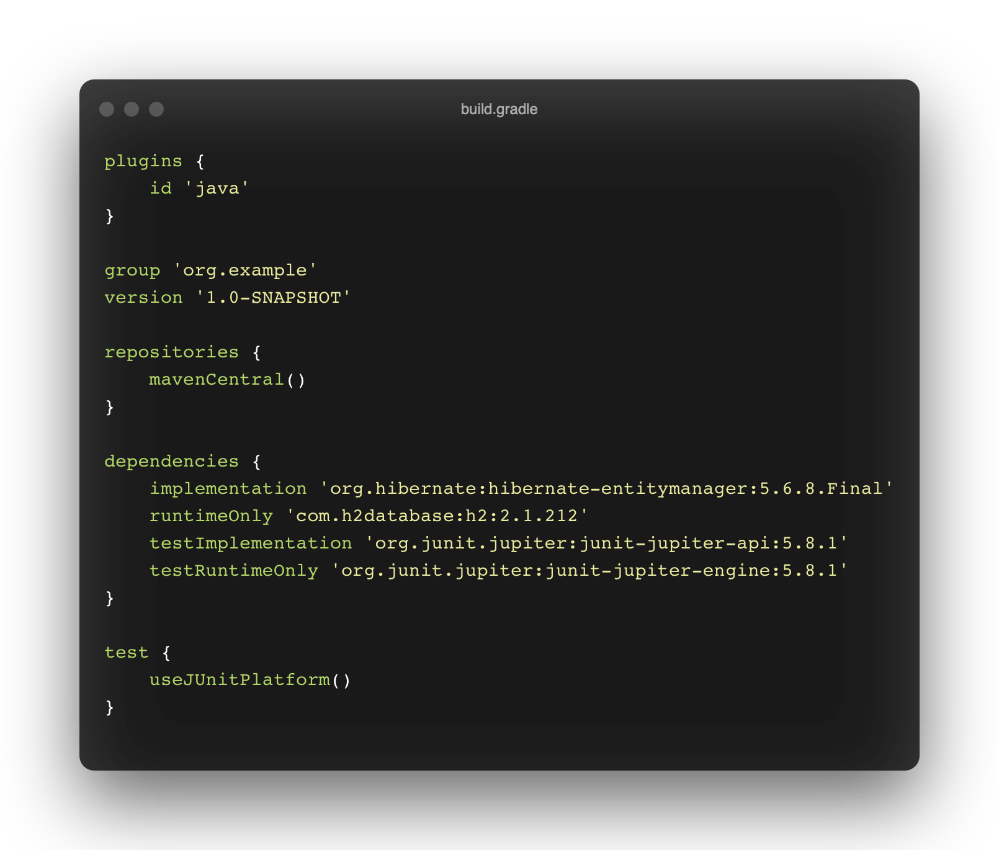
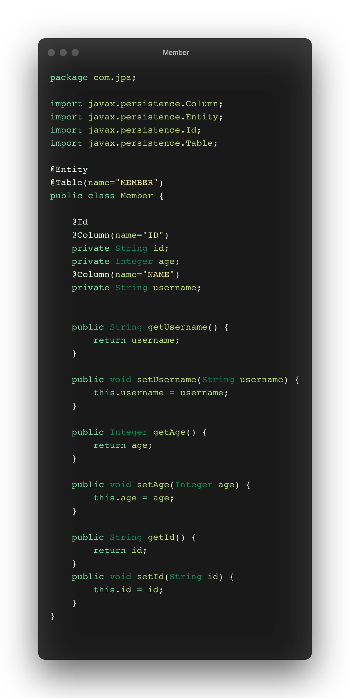
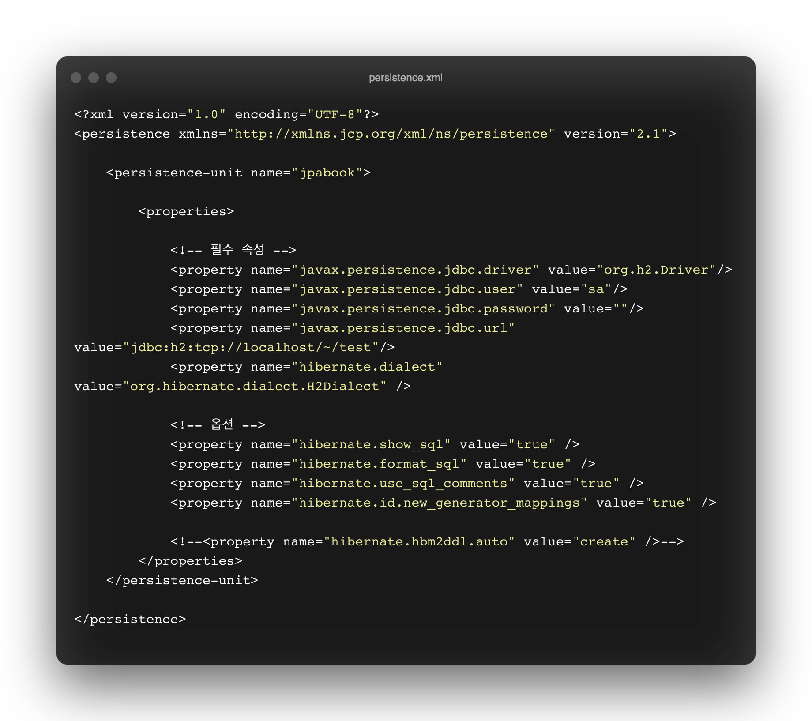
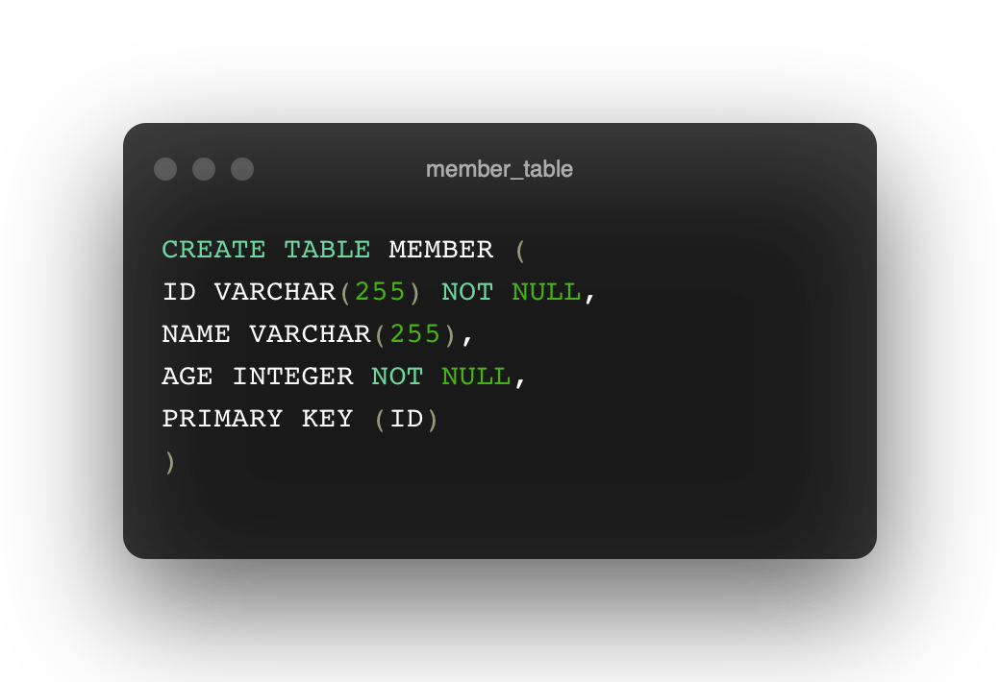
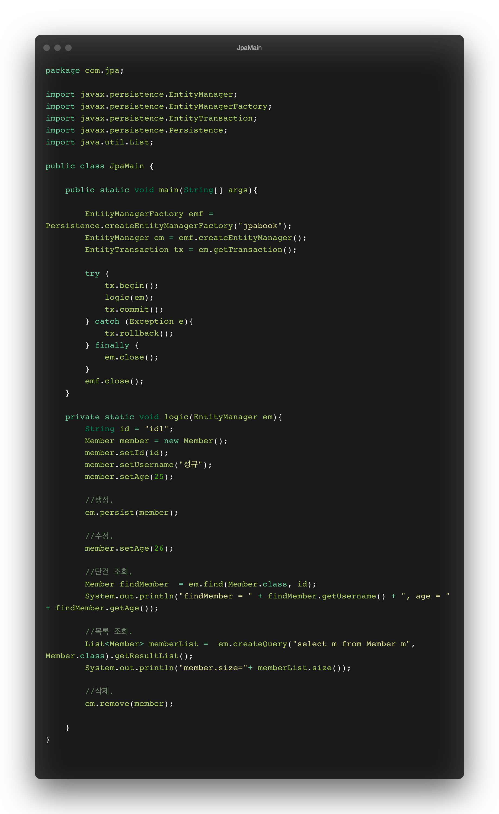

# JPA 시작

## Setting

build, 외부 라이브러리 관리 툴 : gradle.

java : java11

db: h2 (인메모리 db)

library: hibernate-entitymanager (hibernate-core, hibernae-jpa 포함.)

spring-data-jpa가 아닌 hibernate 구현체를 사용하였습니다. 따라서 java+gradle로 프로젝트를 생성하고 라이브러리를 주입해 줍니다.

db에는 회원들의 정보를 관리하기위한 회원 테이블이 있다고 가정합시다.

hibernate(jpa 구현체)를 이용해 db의 회원 테이블에 접근하기위해서는 db의 테이블과 매칭이되는 클래스를 우선 만들어주어야합니다.

id, age, username 멤버변수를 선언해주고 아래에 getter와 setter를 만들어 줍니다.

그리고 해당 클래스를 db 멤버 테이블과 매핑시켜주기위해 JPA가 제공하는 여러 어노테이션을 적용해줍니다.

JPA 어토네이션의 패키지는 javax.persistence임을 알 수 있으며, @Entity, @Table, @Column, @Id 어노테이션이 사용되었습니다.

- @Entity : 해당 클래스를 테이블과 매핑하겠다고 JPA에게 알려줍니다.
- @Table : 매핑되는 db 테이블의 정보를 알려줍니다.
- @Id : 어노테이션이 달린 필드를 테이블의 primary key와 매핑합니다. @Id어노테이션이 달린 필드를 식별자 필드라고 합니다.
- @Column : 해당 필드를 컬럼에 매핑합니다. 여러 속성으로 db 테이블의 어떤 컬럼과 매핑할지 지정하고 추가 설정을 할 수 있습니다.

db를 사용하기위해 환경설정을 해줍니다.

JPA는 main/resources/META-INF/persistence.xml에서 필요한 설정 정보를 관리합니다. 해당 경로에 파일이 위치하면 별도 설정없이 JPA가 인식할 수 있습니다.

<property name="hibernate.dialect" value="org.hibernate.dialect.H2Dialect" />라는 설정을 주목해볼 필요가 있습니다.

dialect는 한국어로 방언이라는 의미로 SQL 표준을 지키지 않거나 특정 데이터베이스만의 고유한 기능을 JPA에서는 방언이라고 합니다.

따라서 어떤 DB의 방언을 사용할지를 환경설정에 적어주기만 하면 됩니다.

hibernate는 다양한 db의 방언을 제공하기에 개발자는 데이터베이스가 변경되어도 어플리케이션 코드를 변경할 필요 없이 환경설정의 코드 한줄만 변경해주면 됩니다.

h2 db를 사용하기위해서는 h2를 설치해야합니다. www.h2database.com에 들어가셔서 all platfroms 혹은 로컬 os에 맞는 것을 다운받으시면됩니다. h2는 경령화 db이기에 용량이 매우 작기에 부담갖지말고 받아주시면 됩니다. (spring project 기반으로 사용한다면 h2가 내장되어있기에 따로 로컬에 설치할 필요가 없습니다.)

설치가 완료되었다면 설치된 폴더 경로로 들어가셔어 bin/h2.sh 를 입력해 db를 서버 모드로 실행합니다.

실행 후 member 테이블을 만들어줍시다.

db와 연결이 안되는 문제가 생길 때, [https://bluayer.com/23](https://bluayer.com/23)

## 어플리케이션 개발

main 메소드에서 코드는 3부분으로 나뉘어 있습니다.

- 엔티티 매니저 설정.

    엔티티 매니저 팩토리를 생성합니다. JPA를 시작하기위해서는 우선적으로 생성해야합니다. 팩토리는 생성 비용이 크기 때문에 한 번만 생성하여 공유하여야합니다.

    엔티티 매니저를 생성합니다. 팩토리에 의해 생성되며, JPA 기능 대부분은 매니저가 제공합니다. 등록/삭제/수정/조회 등의 기능도 마찬가지입니다. 엔티티 매니저는 내부에 데이터베이스를 유지하면서 디비와 통신하며 개발자는 엔티티 매니저를 가상의 디비로 생각할 수 있습니다. 매니저는 디비 컨넥션과 밀접한 관계를 가지므로 스레단에 공유하거나 재사용해서는 안됩니다.

    매니저의 사용이 완료되면 반드시 종료하여야합니다. 팩토리도 어플리케이션이 종료되는 시점에 같이 종료되어야합니다.

- 트랜잭션 관리.

    JPA를 사용하면 항상 트랜잭션 안에서 데이터를 변경해야 합니다. 그게 아니라면 예외가 발생합니다. 트랜잭션을 시작하기위해서는 매니저에서 트랜잭션 API를 받아와야합니다.

    비즈니스 로직이 정상동작하면 트랜잭션을 커밋하고 그게아니라면 롤백을 수행합니다.

- 비즈니스 로직.

    persist()메소드를 사용해 엔티티를 넘겨주면 jpa는 매핑 정보를 분석하여 insert문을 만들어 디비에 전달합니다.

    jpa는 엔티티가 변경되었는지 추적하는 기능을 갖추고 있기 때문에 엔티티의 값을 변경하기만하면 알아서 UPDATE 쿼리문을 수행합니다.

    remove() 메소드를 사용하면 매핑정보를 분석 후, DELETE 쿼리문을 수행합니다.

    전체 회원 목록을 조회하는 코드에서 검색에 조건(전체를 조회)을 추가하기위해 JPQL문을 사용했습니다.

    JPQL은 JPA가 제공하는 객체지향 쿼리 언어이며 엔티티 객체를 대상으로 쿼리하며 SQL은 디비 테이블을 대상으로 쿼리합니다. 따라서 JPQL은 데이터베이스 테이블이 어떻게 구성되어있는지 모릅니다.