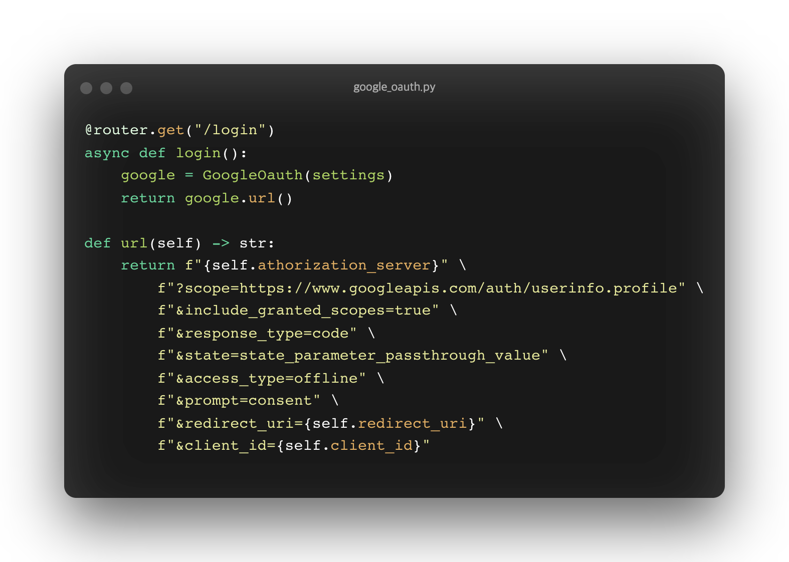
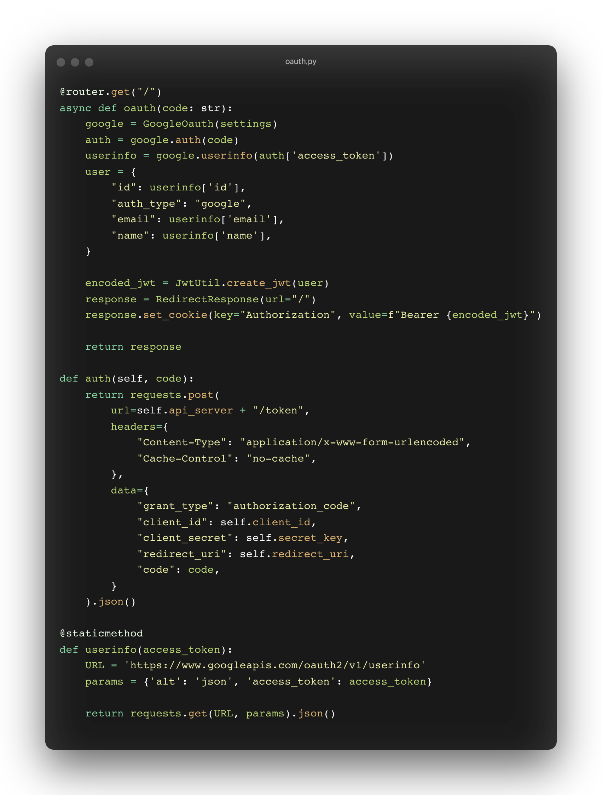
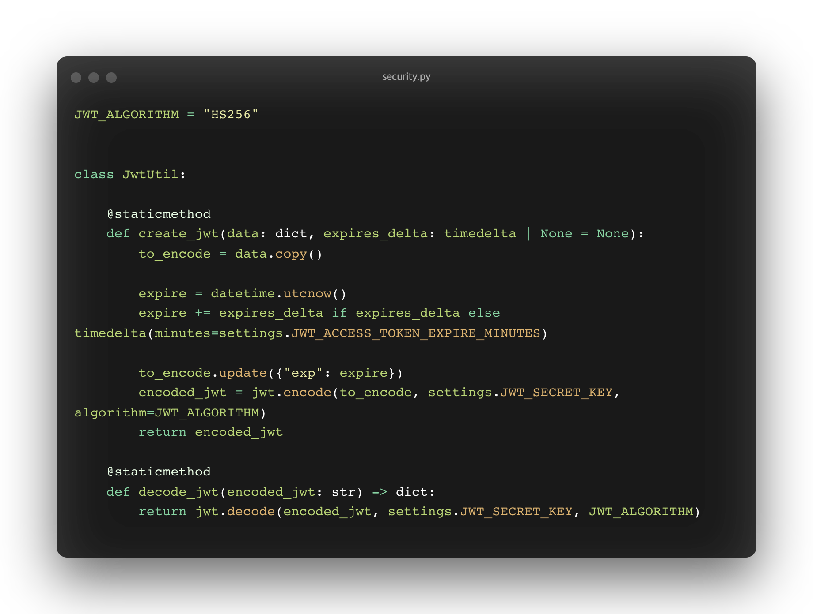
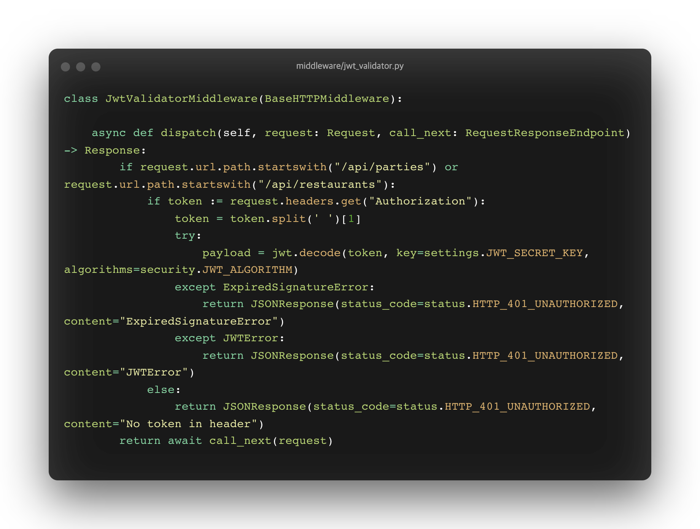

# 인증, 인가

# 인증( Authentication )

정석적인 아이디와 패스워드를 이용한 인증 방법 및 JWT를 사용하는 방법은 FastAPI의 공식문서중 해당 챕터를 참고바랍니다.([링크](https://fastapi.tiangolo.com/tutorial/security/oauth2-jwt/?h=oauth))

여기서는 구글 Oauth 로그인으로 인증을 구현하고, JWT로 인가를 구현하는 것으로 설명합니다.

우선 인증이란, 서비스를 이용하는 유저가 누구인지 확인하는 절차를 의미합니다. 회원가입을 하고 로그인을 하는 것에 해당합니다.

### Oauth

Oauth는  Open Authorization의 약자로 유저의 정보가 있는 다른 서비스가 대신해서 인증과정을 처리해주는 수단으로서의 표준 프로토콜입니다.

- 인증과정을 대신 처리해주는 서비스는 안정적으로 유저들을 관리할 수 있는 이점을 가집니다.
- 인증과정을 맡기는 서비스는 인증 절차를 간편화할 수 있는 이점을 가집니다.

유저들은 일반적으로 여러 서비스에 동일하거나 혹은 유사한 아이디와 비밀번호로 회원가입을 합니다. 아무리 보안이 뛰어난 서비스이더라도 다른 보안이 약한 서비스에서 유저의 정보가 유출되면 동일한 아이디와 패스워드로 설정되어있는 자사의 서비스 보안이 뚤리는 것을 막을 수 없습니다. Oauth를 제공해 줌으로서 이러한 문제를 예방할 수 있습니다.

### Oauth로그인 동작 방식

Oauth 로그인을 단순히 인증의 과정만 사용할 수 도 있지만, 추가로 여러 정보들을 제공받을 수도 있습니다.

( 구글 Oauth 로그인을 예로들면 이메일, 이름과 같은 개인 정보부터 구글 캘린더 등과 같은 API의 개인 정보까지 다양한 유저 정보를 얻을 수 있습니다. )

Step 1. Resource Server(ex. google) 로그인 페이지에서 유저는 로그인을 진행.

Step 2. 유저임이 인증되면 Resource Server에서는 Authorization code라는 임시 패스워드 발급.

Step 3. Authorization Code를 받은 개인 서버에서는 유저의 개인정보를 얻기위해 Access Token 발급.

Step 4. Access Token으로 원하는 유저정보 습득.

그럼 이제 FastAPI에서 oauth를 지원하는 대표적인 기업인 구글의 Oauth로그인 과정을 진행해 봅시다.

( 별도의 라이브러리를 이용하지 않았습니다, 라이브러리를 사용하면 보다 축소된 형태로 구현 가능할지도 )

Step 1. 우선 GCP(구글 클라우드 플랫폼)에서 FastAPI 어플리케이션을 등록해줍니다.

- 등록 후 발급받은 Client ID, Client password와 등록한 Ridirect URI는 리소스 서버 로그인 페이지 URL을 만들거나 access token을 요청하거나 유저 정보를 얻어올 때 사용됩니다.
- Ridirect URI는 리소스 서버 로그인 페이지에서 인증이 되었을 때,  authorization code(임시 패스워드)를 발급해주기위한 Ridirect URI입니다. ex) [localhost:8000/api/auth](http://localhost:8000/api/auth)

    해당 URI는 code라는 파라미터를  함께 반환 받습니다. ex ) async def oauth(code: str):

Step 2. 구글의 로그인 페이지를 띄우기위한 URL을 반환하는 함수를 만들어줍니다.

- 로그인 페이지 url을 만들어주는 url 함수를 보시면 쿼리 파라미터로 정보 획득 범위,  리다이렉트 ur, client_id등 다양한 값들을 포함하고 있것을 알 수 있습니다.

Step 3. 유저가 로그인 페이지에서 로그인 완료 후 인증에 성공하면 Ridirect URI로  Authorization Code(임시 패스워드)를 발급해 줍니다.

- 발급받은 임시 패스워드로 access token 발급(def auth), access token으로 유저 정보 취득(def userinfo)합니다.
- 받은 유저정보를 바탕으로 JWT토큰을 만들어 헤더에 추가하여 client에 메인 페이지를 반환합니다.

Step 4. JWT

최초 로그인 이후 유저 인증 방식으로 JWT를 사용하였습니다. (이는 쿠키와 세션을 사용하는 것과 비교될 수 있습니다.)

최초 로그인 시, 유저 정보를 포함하여 encoding된 JWT를 클라이언트에 전달하고 클라이언트는 JWT를 통해 인증을 합니다.

서버에서는 JWT가 만료기간이 설정되어있다면 지나지 않았는지, 사인이 변형되지 않았는지 등을 체크합니다.

# 인가 ( Authorization )

인가란 인증된 유저가 서비스를 이용하는 것에 대한 권한을 허락하는 것입니다. 경우에 따라 유저는 인가가 되지 않은 특정 서비스는 이용하지 못합니다.

JWT의 payload에 유저 정보를 담아놓았기 때문에 JWT를 이용해 인가 기능을 구현해볼 수 있습니다.

유저의 등급에 따라 접근할 수 있는 범위가 다르거나하면 JWT를 decoding하여 user 정보에 담긴 user의 role을 통해 접근 범위를 제한할 수 있을 것입니다.

여기서는 유저의 등급이 따로 있지 않기 때문에 Token의 유효성만 검증을 하여 검증이 되면 특정 URI로 접근이 가능하도록 하겠습니다.

FastAPI에서는 Middleware로 요청된 uri로 매핑되기 이전과 이후에 원하는 처리를 해줄 수 있습니다.

BaseHTTPMiddleware 클래스를 상속받아 dispatch 메소드를 이용해 전처리를 구현할 수 있습니다.

/api/parties , /api/restaurants URI로 접근시 header에 있는 JWT 토큰을 검증하도록(decode) 구현하였습니다.

[FastAPI middleware - basic](https://fastapi.tiangolo.com/tutorial/middleware/)

[FastAPI middleware - advanced](https://fastapi.tiangolo.com/advanced/middleware/)
