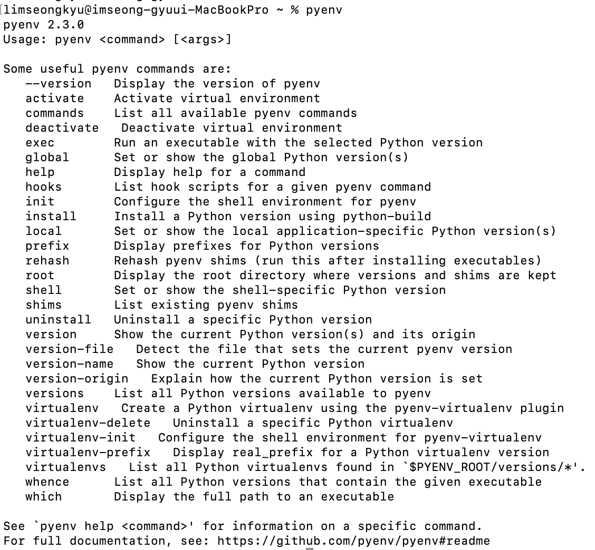
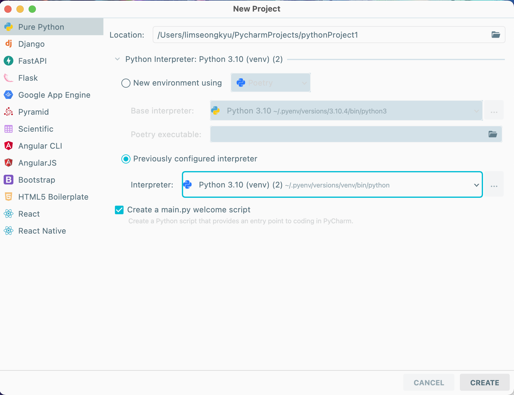

# <span style={{color: '#4fddbf'}}>pyenv를 사용하여 파이썬 가상환경 만들고 pycharm ide에 적용하기.</span>

## 파이썬 환경을 가상환경으로 사용해야하는 이유는 ?!

python의 버전부터 여러 라이브러리의 버전을 독립적으로 관리할 수 있습니다.

독립적인 환경을 구성하는 것의 중요성을 여러 상황을 통해 함께 공감해봅시다.

python과 여러 라이브러리들의 버전은 계속해서 업그레이드됩니다. 새로운 프로젝트를 진행하면서 다른 기존의 프로젝트에서 사용한 라이브러리의 업그레이드된 버전을 적용하였을 때, 가상환경을 사용하지 않는다면 이전 프로젝트에서는 예전 버전의 기능이 구현되어있는데 라이브러리의 버전은 업그레이드되었기에 호환이 되지않아 오류가나는 상황이 충분히 생길 수 있습니다.

파이썬으로 로컬에서만 작업하는 것이아니라 원격 서버에 배포하는 것과 같은 상황일 때, 해당 프로젝트를 독립적으로 관리하고 있지 않다면, 로컬에 설치되어있는 수 많은 파이썬 라이브러리, 파이썬 버전들 중 해당 프로젝트에서만 사용되고 있는 것을 일일이 체크하는 것은 많은 시간적 비용이 들어갈 것입니다.

이러한 불편한 상황을 사전에 방지하기위해 파이썬으로 프로젝트를 진행할 때는 가상환경을 세팅한 후에 해당 가상환경에서 진행하는 것을 추천드립니다! (여타 다른 언어, 분야에서도 적용이 될 수 있는 논제입니다.)

---

## pyenv로 파이썬 가상환경 만들기

python 가상환경을 만들기 위해 사용할 수 있는 프로그램은 꽤 다양합니다.

- 데이터 분석 관련 다양한 기본 라이브러리들이 세팅되어 지원해주는 conda라는 패키지 관리자.
- 파이썬에서 공식으로 권장하는 패키지 관리자인 pipenv
- 파이썬에 내장되어있는 가상환경 모듈인 venv
- pyenv라는 파이썬 버전 관리 시스템의 플러그인인 pyenv-virtualenv

등 다양한 프로그램이 존재합니다.

그 중 pyenv-virtualenv로 파이썬 가상환경을 만드는 방법에 대해 소개시켜드리겠습니다.

[pyenv](https://github.com/pyenv/pyenv) 는 오픈소스 python version management 툴로써 OS에서 파이썬의 여러 버전을 하나의 프로그램으로 관리할 수 있도록합니다.

( OS에서는 설정한 하나의 파이썬 버전만 사용되도록 하지만 pyenv를 사용하면 여러 버전들을 동시에 관리하여 편리하게 사용이 가능합니다. )

( pipenv, conada등에서도 버전을 선택하여 가상환경마다 다른 버전을 사용할 수 있지만, 선택할 수 있는 파이썬의 버전이 로컬에 설치되어있는 것만 가능하다면 pyenv는 설치가 되어있지않다면 설치와 동시에 적용이된다는 점에서 더 완성도있는 python의 version management 툴이라 할 수 있습니다. )

이제 pyenv를 통해 가상한경을 만들어 보겠습니다.

### Step 1. pyenv와 pyenv-virtualenv 설치.

homebrew를 이용해 설치를 진행하겠습니다.

```bash
brew update
brew install pyenv
brew install pyenv-virtualenv
```

### Step 2. pyenv, virtualenv 관련 설정하기.

자신이 사용하는 쉘 종류에 맞는 설정파일에 접근하여 pyenv, pyenv-virtualenv가 정상 동작하도록 초기화 코드를 추가해줍니다. ( pyenv, pyenv-virtualenv 설치 후 안내 스크립트를 읽고 그대로 해주시면 됩니다. )

vim ~/.zshrc

```bash
eval "$(pyenv init -)"
eval "$(pyenv virtualenv-init -)"
```

pyenv 명령어를 입력했을 때 아래와 같이 명령어 목록이 출력되면 정상적으로 설치 및 설정이 된 것입니다.



### Step 3. pyenv-virtualenv로 가상환경 만들어주기.

```bash

pyenv install --list // pyenv로 설치가능한 리스트 확인

pyenv install <version> //pyenv로 사용하고자하는 파이썬 버전 설치.

pyenv versions // 설치된 버전들 확인. ( * 는 적용되어있는 버전. )

pyenv virtualenv <version> <env_name> // version, env_name으로 가상환경 설치.

pyenv virtualenv 3.9.12 py39 // 3.9.12버전의 파이썬으로 py39라는 이름의 가상환경 구성.

pyenv versions // 3.9.12/envs/py39 로 설치 됨을 확인.

```

ps. pyenv는 공식적으로 window os를 지원하지 않지만,  [pyenv-win](https://github.com/pyenv-win/pyenv-win) 프로그램을 사용하여 설치할 수 있습니다. (  pyenv 깃헙 페이지에서도 소개 )

---

## pycharm IDE에서 pyenv로 만든 가상환경으로 파이썬 프로젝트 만들기

pyenv로 가상환경을 생성하고 원하는 프로젝트 폴더에 pyenv 명령어로 가상환경을 적용할수도 있지만, 대중적으로 파이썬 프로젝트에 많이 사용되는 pycharm으로 가상환경 기반 프로젝트를 만드는 것까지 진행해보겠습니다.

### Step 1.  NEW PROJECT 클릭.

pycharm에서 새로운 프로젝트 생성을 위해 welcome 페이지에서 NEW PROJECT를 클릭해줍니다.

### Step 2. python interperter 설정.



프로젝트 생성 경로와 프로젝트 종류를 알맞게 설정해주었다면, 저희가 만든 pyenv virtualenv를 적용하기 위해 python interperter를  저희가 만든 pyenv 가상환경의 interpreter로 설정해줍니다. (interpreter 실행 파일 경로로 설정)

interpreter실행 파일의 경로 확인 방법 :

```bash
pyenv which python3.9.12
```

일반적으로 pyenv로 설치한 파이썬 디렉토리는 ~/.pyenv/versions 디렉토리에 위치하며, 설치된 파이썬 디렉토리(가상환경 포함)의 인터프리터 실행 파일은 ~/.pyenv/versions/3.6.2/bin/python3.6에 위치합니다.

## create누르면 끝!
