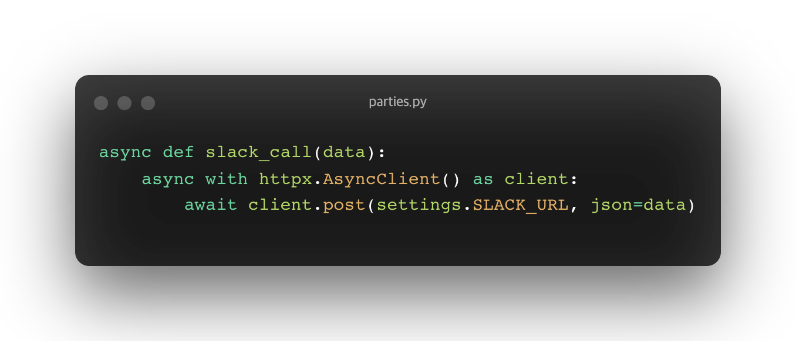

# Slack Incomming Webhook 사용하기.

Slack Incomming Webhook을 사용하여 서버에서 특정 로직이 수행될 때, 슬랙에 자동으로 알림이 가도록 해보겠습니다.

[Sending messages using Incoming Webhooks](https://api.slack.com/messaging/webhooks)

슬랙에서는 다양한 API를 사용할 수 있도록합니다, 그 중 Incomming Webhook(수신 웹훅)을 직접 만들고 사용할 수 있습니다.

### step 1. incomming webhook앱 생성

- 수신 웹훅을 생성하고 요청 url, 앱 이미지 등 정보를 확인합니다.
- 슬랙 문서를 따라서 진행하면 큰 어려움없이 생성할 수 있습니다.
- slack api 관리 : [https://api.slack.com/apps/A03FJ80PQDC](https://api.slack.com/apps/A03FJ80PQDC)

### step 2. 앱의 incomming webhook 활성화 및 workspace와 연결.

- 알림을 띄울 슬랙 워크스페이스 채널에 만든 앱을 추가해줍니다.
- 워크스페이스에 생성한 앱을 설치 할 때, ‘****설치할 봇 사용자가 없습니다’****라는 에러가 난다면, [해당 블로그 글](https://velog.io/@dulcis-hortus/slackbot-%EC%84%A4%EC%B9%98%ED%95%A0-%EB%B4%87-%EC%82%AC%EC%9A%A9%EC%9E%90%EA%B0%80-%EC%97%86%EC%8A%B5%EB%8B%88%EB%8B%A4)을 참고해주세요!

### step 3. 발급받은 webhook URL로 post+ json data 요청.

- 해당 url은 단일 사용자 및 단일 채널에 고유한 url.
- json data의 형식이 정해져있기 때문에 정해진 형식을 지켜야 정상적으로 메세지가 띄워집니다!

### step 4.  내용 꾸미기

- 전송할 데이터를 마음 껏 꾸밀 수 있습니다.
- 슬랙 문서에 데이터 형식과 꾸미는 방법에 대한 설명들이 있습니다!

## FastAPI에서 요청.

FastAPI에서 해당 요청 로직을 비동기로 처리해주기 위해서는 request 라이브러리 대신 [httpx](https://www.python-httpx.org/async/)라는 라이브러리를 사용해야합니다. (request는 비동기 처리를 지원하지 않음.)

