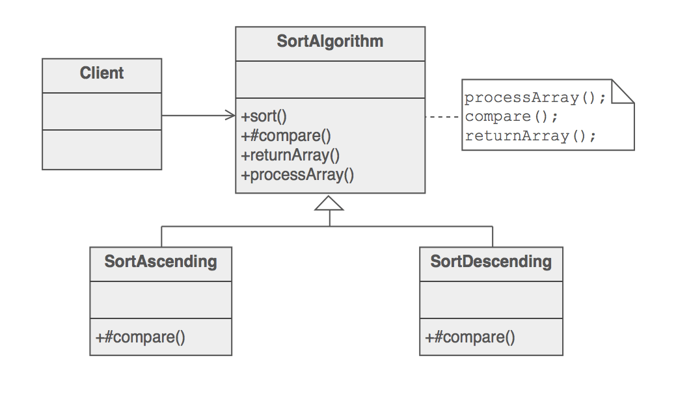
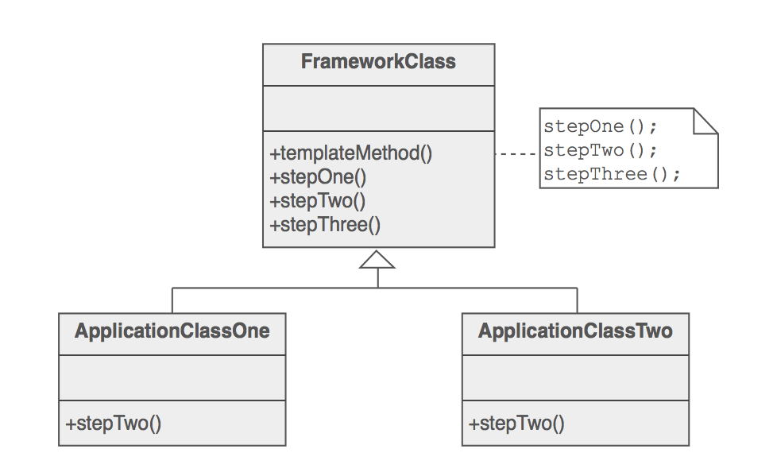
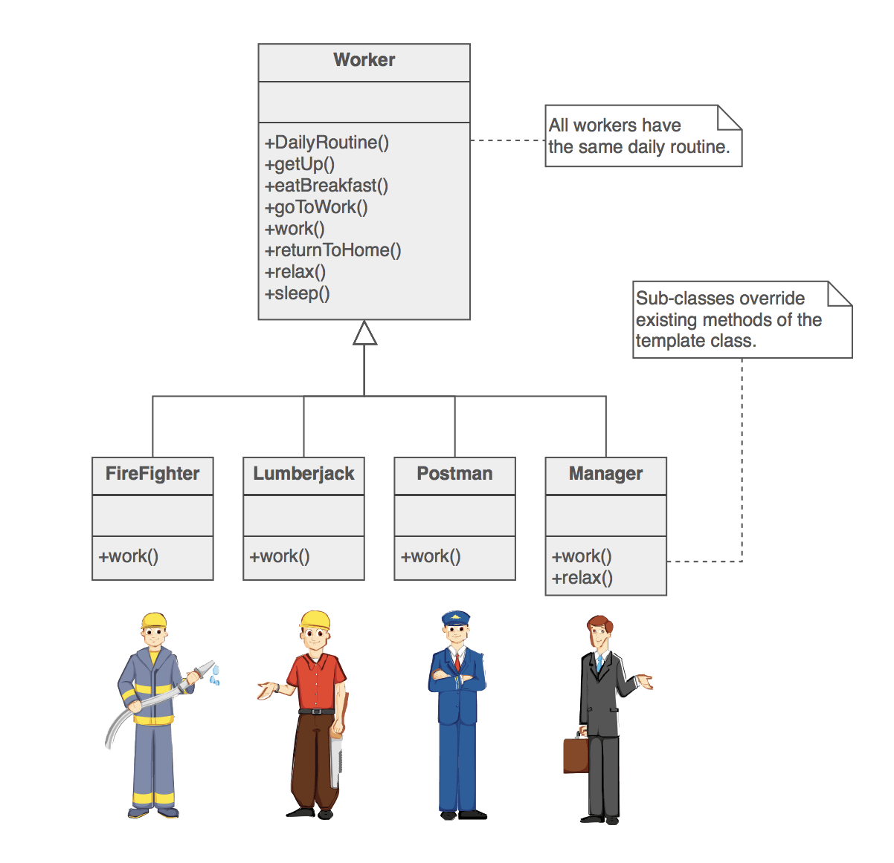
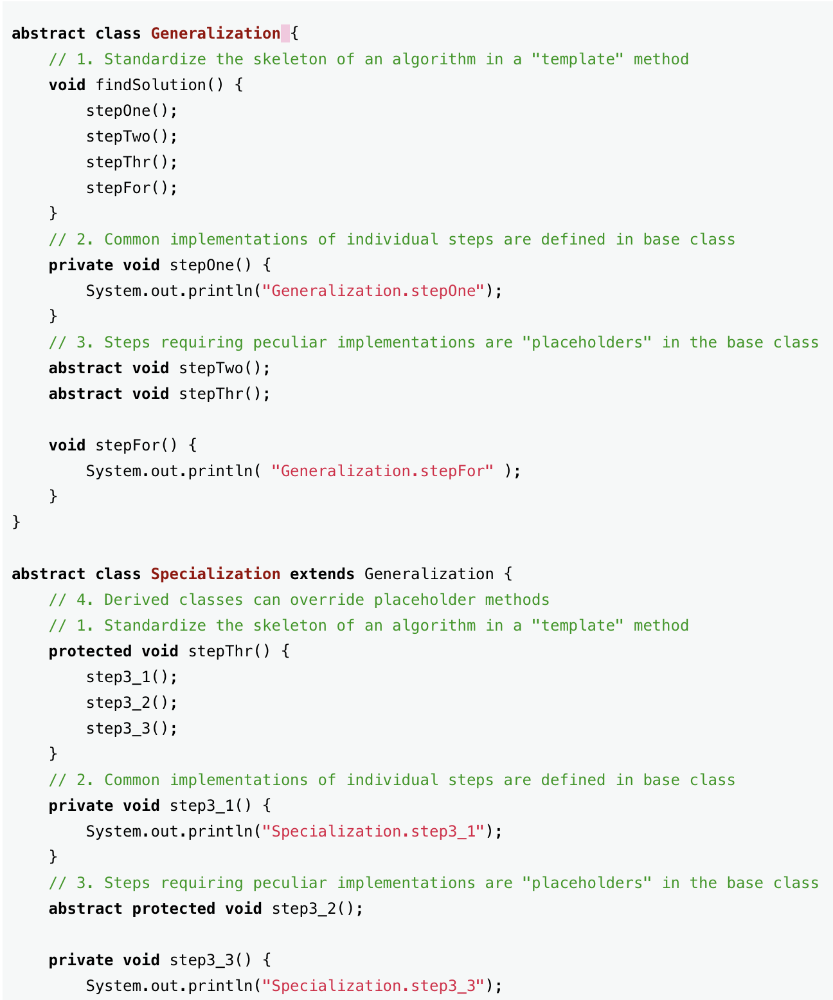
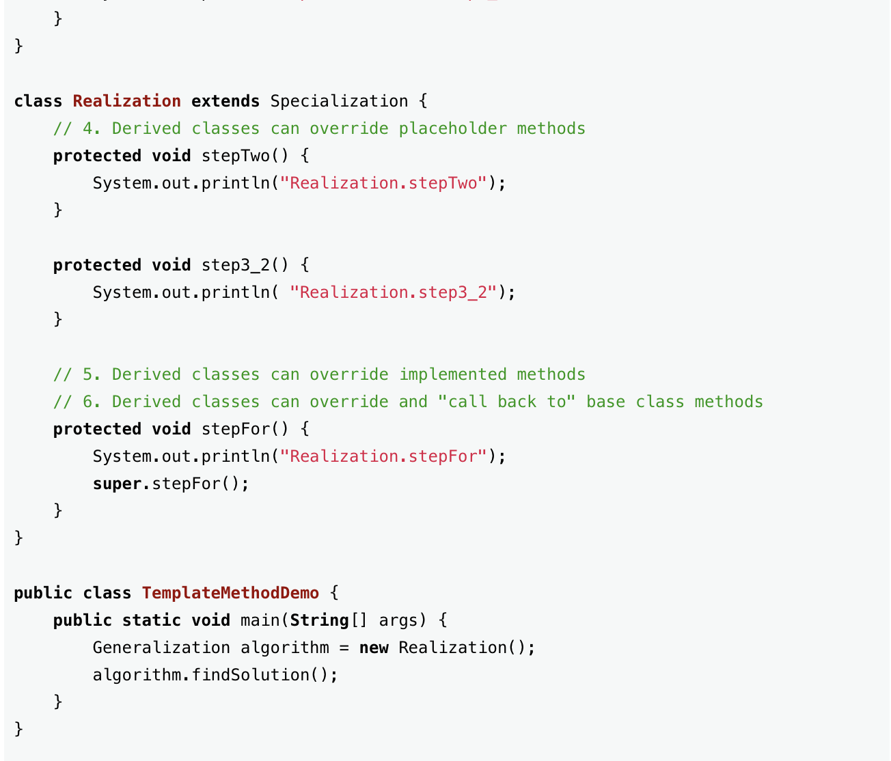

# Behavioral Pattern

## Templete Method

---

### Intent

> 특정 operation의 알고리즘 skeleton을 미리 지정하여 operation의 실행 순서는 보장하고, operation 내부의 각각의 step은 수정하거나 사용할 수 있게 합니다.
>

---

### Structure

---

---

### Example

---

### Templete method 구현

1. Standardize the skeleton of an algorithm in a base class "template" method
2. Common implementations of individual steps are defined in the base class
3. Steps requiring peculiar implementations are "placeholders" in base class
4. Derived classes can override placeholder methods
5. Derived classes can override implemented methods
6. Derived classes can override and "call back to" base class methods

public method와 그냥 method의 차이 ?

→ skeleton 순서를 확장 가능하구나!

→ variant와 invariant를 구분하여 관리하는 것이 효율적이구나!

---

### Advantage

같은 순서로 동작하는 여러개의 컴포넌트들에 대해서 특정 절차를 수정해야하는데 여러개의 컴포넌트들은 서로 연관성이 없기에 일일이 모두 수정해주어야합니다.

→ Templete method를 적용하면 한번에 수정이 가능합니다.

## command

## observer

## Iterator

## CoR