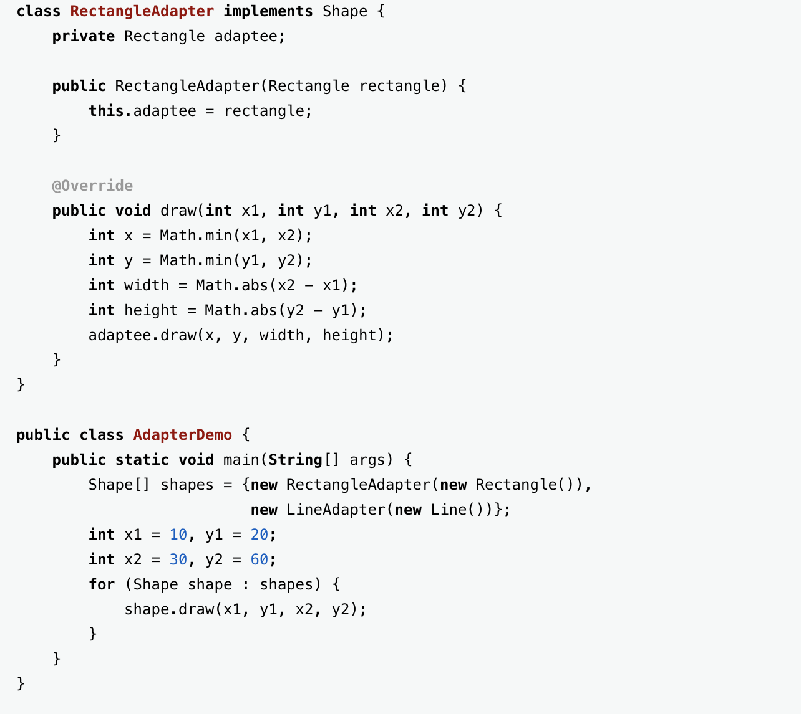
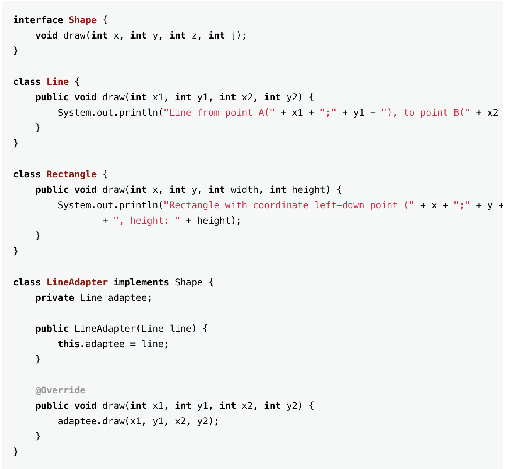
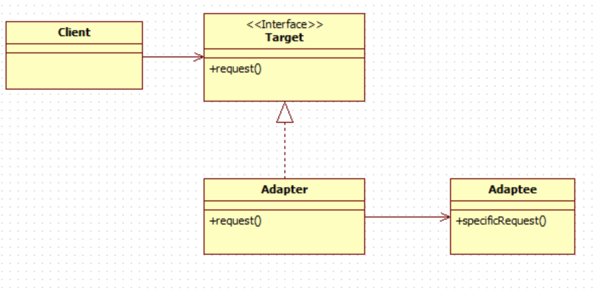
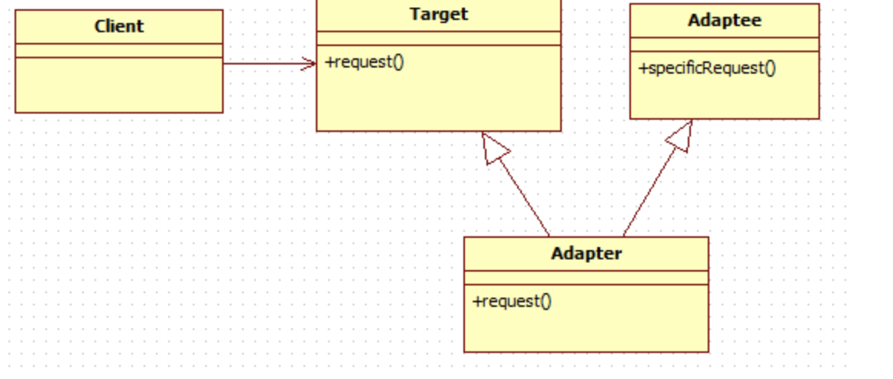
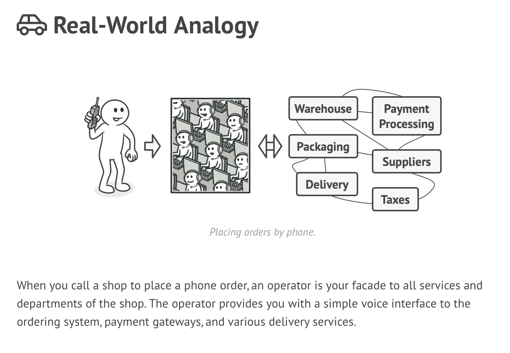

# Structural Pattern

구조 패턴은 더 큰 구조를 형성하기 위해 어떻게 클래스와 객체를 합성하는가와 관련된 패턴입니다.

## Adapter

클래스의 인터페이스를 사용자(client)가 기대하는 인터페이스 형태로 적응(변환)시킵니다. 서로 일치하지 않는 인터페이스를 갖는 클래스들을 함께 동작시킵니다.

### 활용성

- 기존 클래스를 사용하고 싶은데 인터페이스가 맞지 않을 때
- 이미 만든 것을 재사용하고자 하나 이 재사용 가능한 라이브러리를 수정할 수 없을 때
- 이미 존재하는 여러 개의 서브클래스를 사용해야 하는데, 이 서브클래스들의 상속을 통해서 이들의 인터페이스를 다. 개조한다는 것이 현실성이 없을 때, 객체 적응자를 써서 부모 클래스의 인터페이스를 변형하는 것이 더 바람직함 ( Object adapter만 해당)

### 참여자

- Target: 사용자가 사용할 응용 분야에 종속적인 인터페이스를 정의하는 클래스입니다.
- Client: Target 인터페이스를 만족하는 객체와 동작할 대상입니다.
- Adaptee: 인터페이스의 적응이 필요한 기존 인터페이스를 정의하는 클래스로서, 적응대상자라고합니다.
- Adapter: Target 인터페이스에 Adaptee의 인터페이스를 적응시키는 클래스입니다.

### 예제

클라이언트 -> request() -> 어댑터 - translatedRequest() -> 어댑티.

어댑터는 타겟 인터페이스를 구현하며, 어댑티 인스턴스가 들어있음.

### Adapter의 종류

class adapter

어댑터를 만들 때 타겟과 어댑티 모두의 서브 클래스로 만든다.

object adapter

**구성을 통해서 어댑티에 요청을 전달한다**

---

## Facade

### 의도

---

한 서브시스템 내의 인터페이스 집합에 대한 획알화된 하나의 인터페이스를 제공하는 패턴으로, 서브시스템을 사용하기 쉽도록 상위 수준의 인터페이스를 정의합니다.

### 동기

---

시스템을 서브시스템으로 구조화하면 복잡성을 줄이는 데에 큰 도움이 됩니다.

퍼사드 패턴은 서브시스템들 사이의 의사소통 및 종속성을 최소화하려는 것입니다.

주어진 서브시스템의 기능들에 대한 단순화된 하나의 인터페이스를 제공하기위해 퍼사드 패턴을 고안하였음.

### 활용성

---

- 복잡한 서브시스템에 대한 단순한 인터페이스 제공이 필요할 때,
- 추상 개념에 대한 구현 클래스와 사용자 사이에 너무 많은 종속성이 존재할 때

  → 호출은 계속해서 존재하지만, 호출을 하지 않아도 되는 부분은 내부적으로 처리하여 호출횟수를 줄임.

- 서브시스템을 계층화시킬 때

### 참여자

---

퍼사드(Facade): 단순하고 일관된 통합 인터페이스를 제공하며, 서브시스템을 구성하는 어떤 클래스가 어떤 요청을 처리해야하는지 알고 있으며, 사용자의 요청을 해당 서브시스템 객체에 전달합니다.

서브시스템 클래스들: 서브시스템의 기능을 구현하고,  Facade 객체로 할당된 작업을 실제로 처리하지만 Facade에 대한 아무런 정보는 없습니다. 즉, 이들에 대한 어떤 참조자도 가지고 있지 않습니다.

Facade Pattern을 적용함으로서 얻는 이익

---

- 서브시스템의 구성요소를 보호할 수 있음.

  →사용자가 다루어야할 객체의 수가 줄어들어 사용성 향상.

- 서브시스템과 사용자 코드 간의 결합도를 더욱 약하게 만듬.

  →서브시스템 내의 요소를 다양화하는 작업을 원할하게 함.

## composite
## decorator
## proxy
