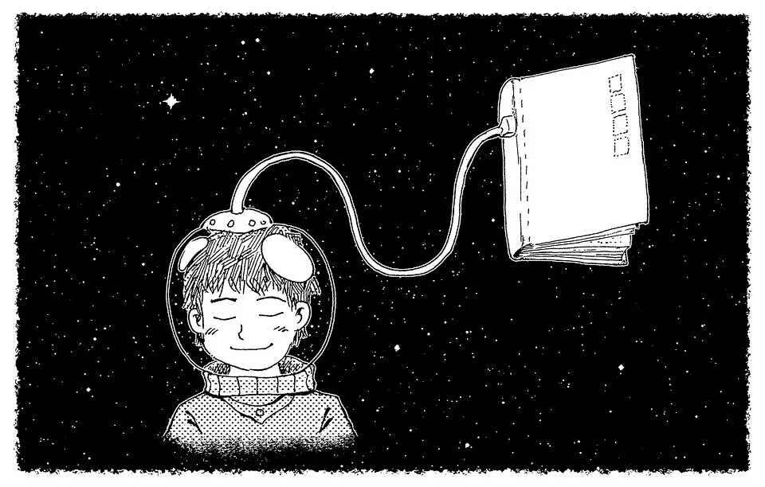

안녕하세요, 성장하는 개발자 임성규입니다! :)

2015.03 - 대학 입학(컴퓨터공학과) & 노트북으로 코드 짜보기 시작!

2015.08 - 파이썬을 배우는 수업을 들으며 반복문에 어질어질

2016.03.22 ~ 2017.12.21 - 군대에서 컴퓨터 기본 원리, 보안 등 관련 서적 취침전에 습득

2018.04 - 스택, 힙, 트리 등을 C언어로 구현하는 과제를 하며 코드짜는 것의 위대함(?) 경험

2020.10 - 딥러닝, 머신러닝에 매료되어 해커톤까지 참여, 최우수상(2등) 획득

