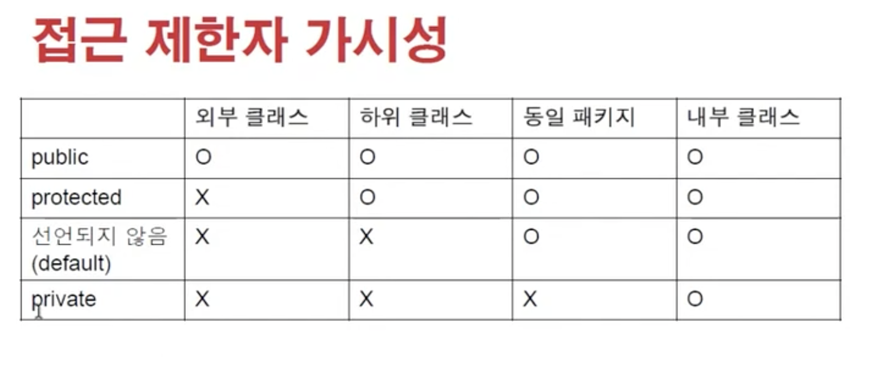
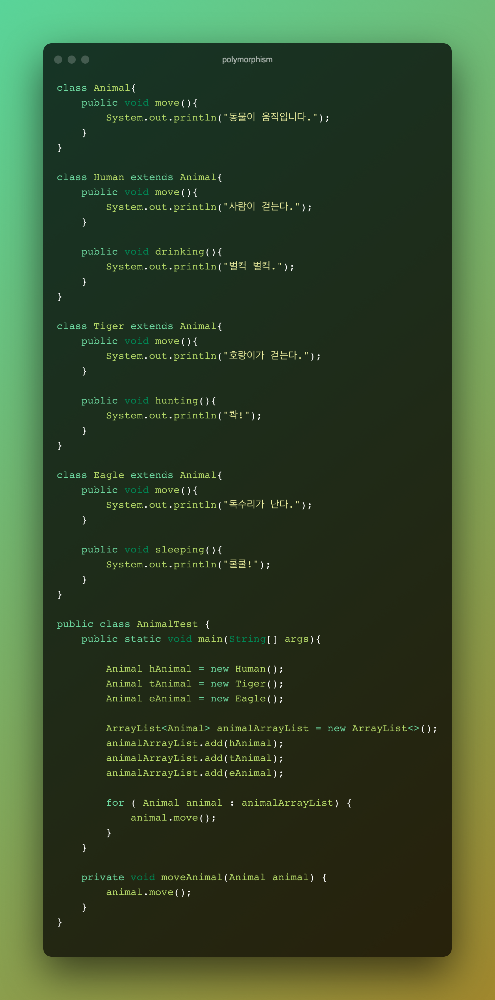
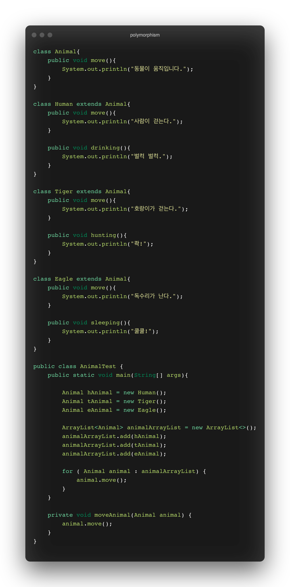
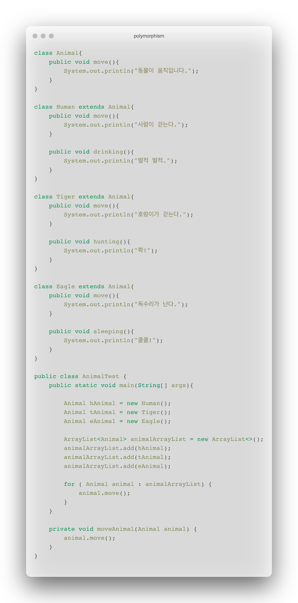

# 상속과 다형성

## 상속이란 ? ( Inheritance )

클래스를 정의할 때, 이미 존재하는 클래스를 상속받아 상속하는 클래스의 속성이나 기능을 확장하는 것을 의미합니다.

하위 클래스와 상위 클래스의 관계는 일반적인 개념에서 구체적인 개념으로 나아가야 할 것입니다.

상속을 받은 하위 클래스가 생성될 때는, 상속을 한 상위 클래스가 먼저 생성됩니다.

→ 컴파일 단계에서 하위 클래스의 생성자에 super() 코드가 추가되며 해당 코드는 상위 클래스를 참조(상위 클래스 주솟값을 이용해서)하여 상위 클래스 디폴트 생성자를 호출합니다.

→ 상속을 받지 않은 일반 클래스도 마찬가지로 생성자가 호출될 때 super() 코드가 추가되며 object 클래스에 접근하여 생성자를 호출합니다. (자바에서 모든 클래스의 최상위 클래스는 Object 클래스입니다.)

→ 상위 클래스의 멤버변수, 메소드를 힙 메모리에 먼저 생성하고, 하위 클래스의 멤버변수, 메소드들을 생성합니다.

## 상속은 언제 사용할까 ?

클래스들 사이의 관계가,

IS-A 관계 (is a relationshipe - inheritance )

일반적인 개념과 구체적인 개념의 관계일 때,

HAS-A 관계 (composition)

한 클래스가 다른 클래스를 소유한 관계일 때 ( 학생 - 듣는 수업 )

적용하면 좋습니다.

## 업캐스팅 ( Upcasting )

하위 클래스는 상위 클래스의 타입을 내포하고 있습니다. 따라서 하위 클래스의 타입을 상위클래스로하여 사용할 수 있습니다.

타입이 상위 클래스로 지정되어있기 때문에 하위 클래스에만 정의된 멤버 변수나 메소드에 접근할 수는 없습니다.

↔ 다운 캐스팅.

## 오버라이딩 ( Overriding )

상위 클래스에 정의된 메소드 중 하위 클래스에서 기능이 맞지 않거나 추가 기능이 필요한 경우 상위 클래스의 메소드와 같은 이름, 매개변수로 하위 클래스에서 재정의(오버라이딩)을 할 수 있습니다.

오버라이딩은 자바에서 가상 메소드( virtual method ) 기능을 지원하기 때문에 가능합니다. 자바에서 가상 메소드는 모든 메소드에 적용이 되며, 객체의 타입과 관계없이 생성된 인스턴스의 메소드가 호출됩니다. 즉, 재정의된 메소드에 대해서 상위클래스의 메소드가 아닌, 하위 클래스의 메소드가 호출됩니다.

## 다형성이란 ?

하나의 코드가 여러가지 자료형으로 구현되어 실행되는 것입니다.

정보은닉, 상속과 더불어 객체지향 프로그래밍의 가장 큰 특징 중 하나입니다.

객체지향 프로그래밍의 유연성, 재활용성, 유지보수성에 기본이 되는 특징입니다.

