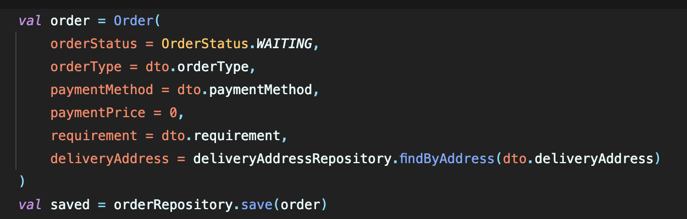
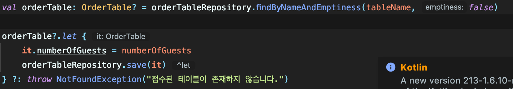

### 코프링 (코틀린 + 스프링)에서 entity는 자바+스프링에서 사용하는 방법과 어떻게 다를까 ?

12월 말부터 시작한 코틀린 + 스프링 온라인 스터디 모임에서 코틀린에 대한 기본적인 문법 공부를 마치고 간단한 프로젝트를 기획하고 시작하게 되었다.

스터디의 목적이 코틀린 자체의 언어를 학습하고 스프링에 적용해보는 것이 목적이었기에 프로젝트의 기획은 따로 하지 않고 next-step이라는 교육 단체에서 진행한 음식점에서 사용하는 주문 포스기 프로젝트를 차용하였다. 전체적인 틀은 차용하고 세부적으로 구현할 것에 대해서는 팀원분들과 이야기를 나누며 구체화해 나갔다. er-diagram을 짜고, 환경 세팅을 현직에서 코틀린으로 스프링을 다루고 계신 스터디장님께서 맡아 해주셨고, 주문, 상품, 배달, 메뉴(상품의 집합)으로 도메인을 나누었고 나는 주문 로직을 맡아 진행을 하게 되었다.

er-diagram이 만들어 졌으니 스프링에서 DB에 쓰일 필드와 테이블관의 연관관계 설정을 위해 entity를 만드는 작업을 시작하였다.

프로젝트를 진행하기 전에 공부한 코틀린 문법을 바탕으로 java+spring에서 entity를 만들어주듯이 코드를 써내려갔다.

사용언어가 코틀린이든 자바든, 스프링에서 지원하는 기능은 언어와 무관하게 동일한 문법일 것이기 때문에, 평소에 짜듯이 클래스에 이 클래스가 entity임을 알려주고 빈등록을 위한 @Entity을 붙여주고, id 컬럼을 만들어주고, 필드들을 생성해줬다.

코틀린은 해당 변수가 불변이면 val, 가변이면 var을 명시해주므로, 첫 번째 고민에 빠졌다.. entity의 각 필드는 불변으로 선언하는 것이 맞을까? 아니면 가변으로 선언하는 것이 맞을까? .. 조금의 고민 끝에 var로 우선 선언을 해주었다.

가변으로 선언해준 이유는, 특정 필드를 업데이트하는 로직과 같은 경우에, entity에 디비의 데이터를 불러와 특정 필드를 수정해주어야하는데 이러한 상황에서 해당 필드가 불변이면 수정이 안될 것이기 때문이다..!

코프링을 시작하고 마딱드린 첫 번째 고민은 이렇게 해결을 하였고,, 코틀린에서는 변수의 타입을 후위에 ‘:’ 키워드 다음에 붙여 주므로 공부했던대로 필드를 정성스레 만들어준다.

id에 해당하는 필드에 @Id어노테이션과 생성 전략도 IDENTITY로 설정을 해준다.

아 맞다, 코틀린에서는 공포의 nullPointerException에 대해 완전한 안전성을 주기 위해, 변수가 null이 가능한지 아닌지를 ‘?’기호 하나로 명시해줄 수 있다. ?가 타입뒤에 붙게되면 nullable한 변수가 되고 ?가 없으면 non-null인 변수가 되는 것이다..!

두 번째 고민이 든다.. 엔터티의 필드들은 nullable해야할까? 아니면 non-null이어야할까 ?

자바로 엔터티를 만들 때를 다시 떠올려보자.. 해당 필드가 빈값으로 디비에 저장되면 안될경우에, @NotNull로 null이면 안된다는 것을 명시해주었다. 어라, kotlin에서는 db에 넣기 한참 전에, 최초에 디비에 넣기위한 entity 데이터를 만드는 순간에 언어적 차원에서 ?키워드하나로, 해당 필드가 null이 가능한지 불가능한지를 컨트롤할 수 있게 되었다. 그러면 해당 필드가 null이어도 되는지 안되는지를 생각해보았고 nullable여부를 설정하여 해결하였다.

마지막으로 lombok의 어노테이션들도 엔터티 클래스에 추가해 주었다.

코드를 다 짜고 보니, 자바로 엔터티를 만들어 준거랑 크게 다른게없다..! 코틀린 문법을 학습할 때 분명 여러 다양한 클래스들이 존재하고 자바와는 다른 문법들이 존재하였는데, 막상 스프링에 적용하고 보니 평소 자바로 짠 코드와 비슷하다.. 내가 아직 코틀린 문법을 잘 활용하지 못하는 건가 싶어 코틀린으로 만든 entity코드들을 조사해보았다.

다른 분들이 짠 코드들을 여러개 봐보고, 우하한 테크 세미나에서 진행한 코프링 강의를 보니 여러 개선점들이 눈에 띄었다.

우선 첫 번째로, var 선택에 대한 조심이 필요하다는 것.

필드들을 var로 선언한 것은 앞에서 설명한 이유가 타당하다고 생각한다. 하지만 코틀린은 기본적으로 val을 권장하고 val을 씀으로써 코드 로직에 있어 안정감을 주게 된다. 따라서 변수값이 변하는 상황이 없다고 생각되는 경우, val을 사용하도록 하자!

두 번째로, data class를 entity 클래스에서 사용하는 것을 지양하자.

코틀린에서는 data만을 다루는 목적의 클래스를 따로 제공한다. data키워드를 추가하여 class를 생성해주면 해당 클래스는 lombok의 @Data 어노테이션과 같이 getter, setter을 지원하고 toString, toEqual, hashCode()와 같은 Canonical Methods도 지원을 한다!

나는 별 생각없이 엔터티를 일반 클래스로 만들어줬는데, entity클래스또한 데이터를 다루는 목적의 클래스이므로, data class를 사용한는 것이 적합할텐데, entity에서는 사용을 지양하라고 해서 별 생각없이 올바른 코드를 짰다.

entity클래스를 data 클래스로 구현하는 것을 지양하는 이유는, 엔터티끼리 양방향 연관관계가 설정되어있을 때, toString, hashCode()와 같은 함수를 사용하면 무한 순환 참조가 발생할 수 있기 때문이라고 한다.

나중에 알게되었는데, 코틀린에서는 롬복이 지원하는 @Getter, @Setter, @Builder, @RequiredArgsConstructor과 같은 기능을 var, val, 주생성자로 해결이 가능하다.

builder를 사용할 필요없이 아래와 같이 생성자로 값을 넣어줄 수 있고,

업데이트를 해야하는 상황에서 setter를 사용할 필요없이 간단하게 아래와 같이 ‘.’키워드로 접근하여 특정 필드의 수정값을 넣어주면된다!

아직 더 써봐야겠지만, 언어를 바꾸었을 뿐인데, 코드가 많이 단순화되고 직관적이라고 느꼈고, 외부 라이브러리로 사용했던 기능들을 언어 자체의 기능만으로도 충분하게 사용이 가능하다는 것을 알게되었다!