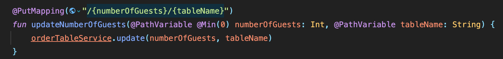
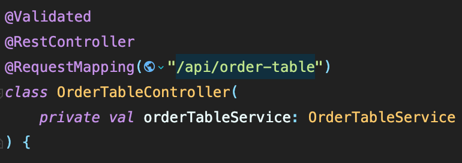
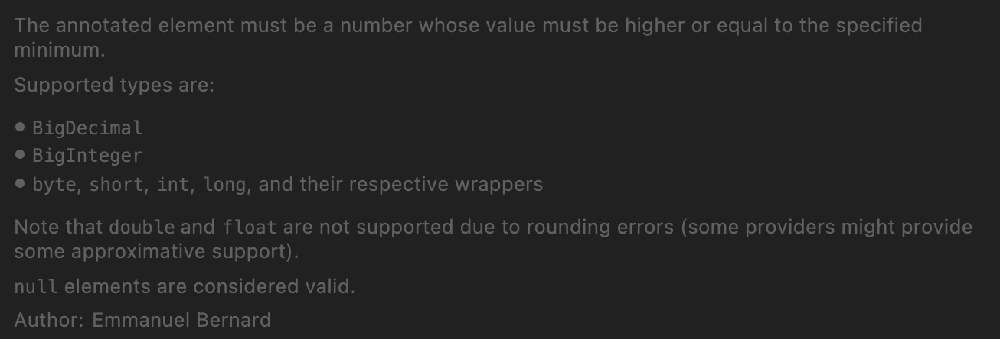
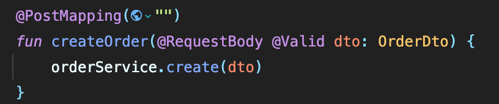
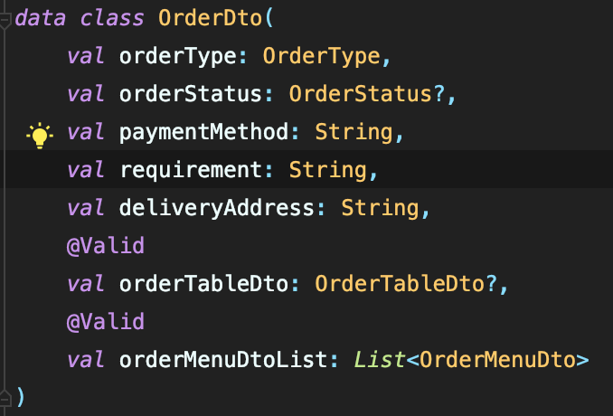
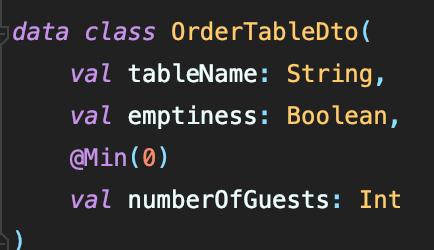
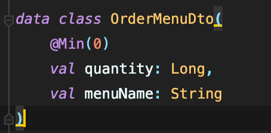

## 프로젝트의 요구사항중에 ‘매장 식사 인원은 최소 0명이상이어야한다.’와 같은 조건이 있다. 특정 변수의 값을 검사하는 방법은 무엇인가 ?

아무런 부가적인 기능들을 알아보지않고 순수 언어단위에서만 생각해보면, 단순하게 받아온 데이터 값(numOfGuests)를 조건문으로 값이 0이상인지 체크하여 처리를 다르게 할 수 있겠다..

하지만 스프링에서는 올바르지않은 데이터를 걸러내고 보안을 유지하기위해 Spring Validation 라이브러리를 지원하며, 이를 통해 데이터의 유효성을 검사할 수 있다.

아래 코드는 매장 식사 주문의 경우, 해당 테이블의 인원이 변경되었을 때 변경된 인원을 업데이트 하는 로직의 controller단이다.

이 때, @PathVariable로 받아오는 numberOfGuests 변수의 유효성을 검사하기 위해서, validation 어노테이션을 바로 해당 변수에 적용을 할 수 있다.

@Min어노테이션을 통해 특정 값 이상인지 여부를 검사할 수 있다.

<해당 어노테이션의 인터페이스의 설명 내용.>

그 이유로는, 아래는 해당 컨트롤러의 어노테이션들인데, @Validated 어노테이션이 적용되어있는 것을 확인할 수 있다. 해당 어노테이션을 클래스에 적용하면, MethodValidationPostProcessor에 의해서 Validation이 가능하도록 프록시 객체가 생성되고 생성된 프록시 객체를 통해서 바로 적용하고 검사할 수 있게 되는 것이다.

그렇다면 controller단에서의 데이터가 아닌, requestBody로 받은 dto안의 특정 멤버, 또는 requestBody로 받은 dto안의 또다른 dto안의 값인 경우, 즉 검사 요소가 서브클래스의 멤버라면 어떻게 유효성을 검사해야할까 ?

이 때는 @Valid 어노테이션을 사용해 검사가 가능하다.

아래의 코드와 같이, @RequestBody로 받은 dto에 @Valid 어노테이션을 붙여주고, 해당 dto에서 가지는 또다른 dto에도 @Valid를 붙여주고 검사를 하려는 클래스에 접근하였을 때, 해당 클래스의 검사하려는 멤버에게 검사를 위한 어노테이션을 붙여준다.

