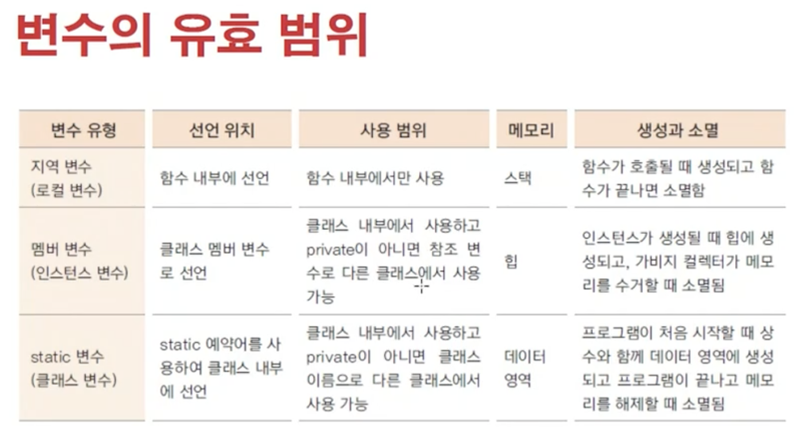

# Static 변수와 메소드

## Static 변수.

Static 키워드를 사용한 ‘정적 변수’는 클래스당 하나만 생성되어 모든 인스턴스가 해당 변수를 공유합니다.

즉, new 키워드로 생성하는 인스턴스마다 멤버 변수가 Heap영역에 새롭게 할당되는 것과 다르게 프로그램이 로드되는 시기에 Data 영역(공유 영역)에 생성이 됩니다. Data 영역에는 static 말고도 상수, 리터럴 등이 생성됩니다.

따라서, Static 변수는 인스턴스 생성과 관계없이 클래스 이름으로 직접 참조합니다. Static 변수는 클래스 변수라고도 합니다. ( 인스턴스 이름 (참조 변수)로 참조하는 것도 불가능하진 않지만 권장하지 않습니다. )

## Static 메소드.

클래스 메소드라고도하며 static 키워드를 붙여 사용할 수 있습니다.

주로 Static 변수를 위한 기능을 제공하기위해 사용합니다.

 static 메소드에서는 멤버 변수, 일반 메소드를 사용할 수 없습니다. 왜냐하면 static 메소드는 프로그램이 로드될 때 생성되기에 인스턴스가 생성되지 않아도 사용이 가능한데, 일반 멤버 변수나 일반 메소드는 인스턴스가 생성되는 시점에 메모리에 생성되기 때문입니다.

즉 생성이 불확실한 멤버 변수, 일반 메소드를 사용할 수 없습니다.

[https://wikidocs.net/228](https://wikidocs.net/228)

