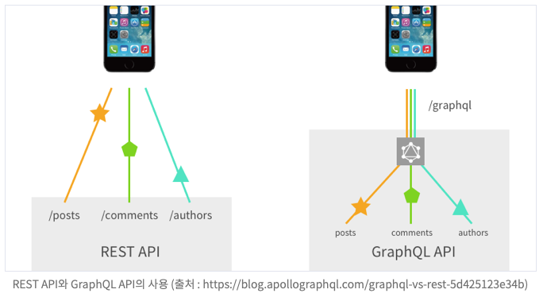

# Rest API / RESTful

### 우선 Rest란 ?
REST(Representational State Transfer)는 월드 와이드 웹과 같은 분산 하이퍼미디어
시스템을 위한 소프트웨어 아키텍처의 한 형식이다. 엄격한 의미로 REST는 소프트웨어 아키텍처 원리의 모음이며, 여기서 '네트워크 아키텍처 원리'란 자원을 정의하고 자원에 대한 주소를 지정하는 방법 전반을 일컫는다.[위키백과]

<REST라는 용어는 로이 필딩(Roy Fielding)의 2000년 박사학위 논문에서 소개되었다. 필딩은 [HTTP](https://ko.wikipedia.org/wiki/HTTP)의 주요 저자 중 한 사람이다.>

---

‘자원을 정의하고 자원에 대한 주소를 지정하는 방법’ 이라는 것에 주목할 필요가 있습니다. 자원(resource)는 해당 서버가 관리하는 모든 것을 의미합니다.(html, image, data, 서버 프로그램 자체..)이러한 자원들을 클라이언트에게 상황에 맞게 제공할 수 있게 HTTP URI로 구분하여 정의하고 주소를 지정합니다.

여기서 더 나아가, REST를 해당 자원(resource)의 상태(정보)를 주고 받는 모든 것이라 정의합니다. 주고 받는 상태(정보)의 형식에는 JSON, XML, TEXT, RSS등이 있으며 클라이언트에서 서버로 상태(정보)를 전달할 때는 HTTP Method를 따라 행위를 요청할 수 있습니다.

### REST의 구성 요소로 다시 한번 정리해보자면...

- 자원
    - 자원은 서버에 존재하며, URI로 자원에 대한 고유한 ID 정의.
    - 클라이언트는 URI를 이용해 자원을 지정하고, 해당 자원의 상태에 대한 조작을 서버에 요청.
- 행위
    - 기본적인 데이터 처리 행위인, CRUD를 HTTP Method에 따라 표시.

- 표현
    - Client와 Server가 데이터를 주고받는 형태로 JSON, XML, TEXT, RSS 등이 있습니다.

### REST를 한문장으로 다시 정의하면!

자원을 정의하고 자원에 대한 주소를 지정하는 방법이며, 그렇게 정의한 자원의 상태(정보)를 주고 받는 모든 것.

---

### REST API란 ?

앞서 설명한 REST의 특징을 기반으로 서비스 API를 구현한 것입니다.

간단히 예를들면 특정 DB 테이블(자원)에 값을 생성할 때, JSON으로 데이터를 받고, 자원의 URI를 정해진 규칙에 맞게 잘 정의하여, HTTP Method의 PostMapping을 이용한다면, 구현한 테이블 데이터 추가 API는 REST API라 할 수 있겠습니다.

### REST를 기반으로하여 API를 구현하면 무엇이 좋을까 ??

- HTTP 프로토콜의 인프라를 그대로 사용하기 때문에, REST API를 사용하기위한 별도 인프라를 구축할 필요가 없습니다.
- 즉, HTTP 표준 프로토콜을 따르는 모든 플랫폼에서 사용이 가능해집니다. 과거에 클라이언트는 대게 브라우저에 한정적이었지만 현재는 모바일 디바이스를 포함하여 다양한 클라이언트가 존재하며, REST를 기반으로 하여 구현하면 멀티 플랫폼에 대해 통합적인 아키텍쳐 설계가 가능합니다.
- 각 요청이 어떤 동작이나 정보를 위한 것인지를 요청 형식 자체로 쉽게 추론이 가능해집니다.
- 서버와 클라이언트의 역할을 명확하게 분리합니다.→ 서로 간의 의존성을 줄임.(자원이 있으며 제공하는 쪽이 서버, 자원을 요청하는 쪽이 클라이언트)

### REST API URI 규칙.

1. URI는 명사(복수형)를 사용한다.

   ex) /update/users (x)  → /users (o) : 행위는 http method로 표기가 이미 되어있습니다.

2. 슬래시(/)로 계층 관계를 표현합니다.

   ex) PatchMapping /user/profile-image

3. 밑줄(_*)이 아닌, 하이픈(-*)을 사용합니다.

   ex) /user/profile_image (x) → /user/profile-image (o)

4. URI는 소문자로만 구성합니다.
5. 파일 확장자는 URI에 포함하지 않습니다.

---

### RESTful 이란?

RESTful은 REST의 설계 규칙을 잘 지켜서 설계된 API를 RESTful한 API라고 하며, 일반적으로 REST API를 제공하는 웹 서비스를 RESTful하다고 합니다. 즉, REST로 아키텍쳐를 구현하는 웹 서비스를 나타내기 위해 사용되는 용어입니다.

RESTful한 API를 구현하는 근본적인 목적은 ‘성능 향상’이 아닌, ‘일관적인 컨벤션’을 통해 API의 이해도 및 호환성을 높여주는 것이 주 목표입니다.

---

### GraphQL

페이스북에서 2015년에 공식적으로 공개하였습니다. SQL과 마찬가지로 쿼리 언어이지만 목적에 있어 차이가 존재합니다. SQL이 데이터베이스에서 데이터를 다루기위한 언어라면, GQL은 클라이언트에서 서버로부터 데이터를 효율적으로 가져오기위한 목적으로 사용됩니다. 즉 GQL은 프론트단에서 작성하고 사용됩니다.

- REST API는 endpoint가 여러개지만, GraphQL은 endpoint가 하나!

  

→ 따라서 RESTAPI가 uri와 method를 일일이 다 정하여 아키텍쳐를 설계하여야하는 반면에, graphql은 그럴 수고를 덜어줍니다.

- 참고자료

  [https://ko.wikipedia.org/wiki/REST](https://ko.wikipedia.org/wiki/REST)

  [https://gmlwjd9405.github.io/2018/09/21/rest-and-restful.html](https://gmlwjd9405.github.io/2018/09/21/rest-and-restful.html)

  [https://dev-coco.tistory.com/97](https://dev-coco.tistory.com/97)

  [https://velog.io/@pjh612/REST-API-URI-규칙](https://velog.io/@pjh612/REST-API-URI-%EA%B7%9C%EC%B9%99)
