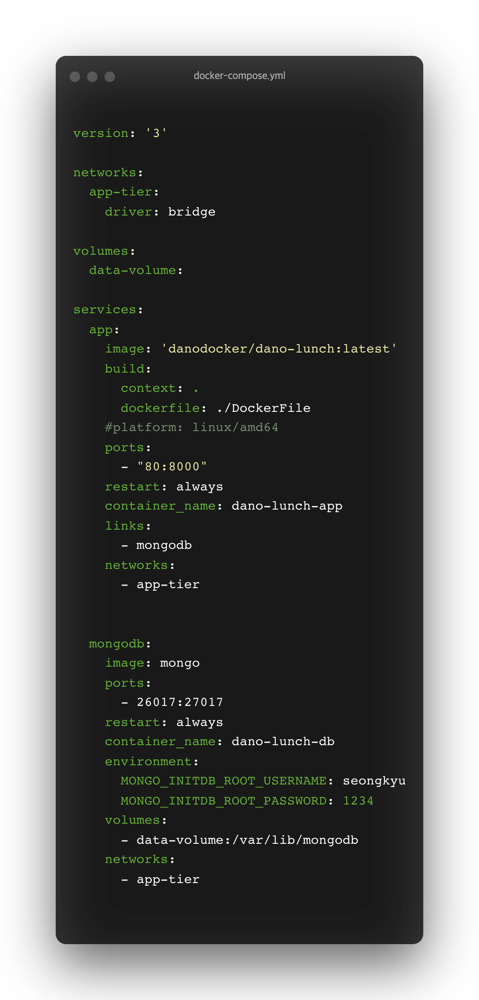
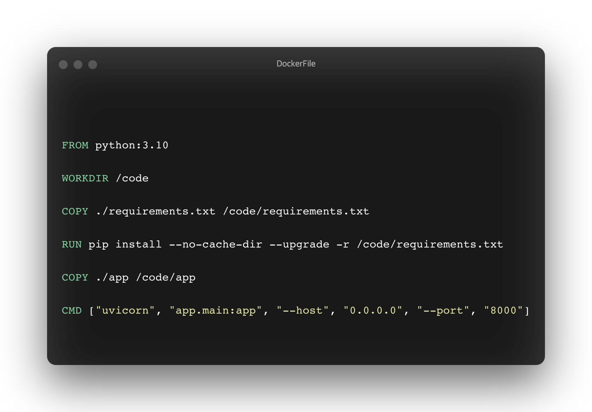
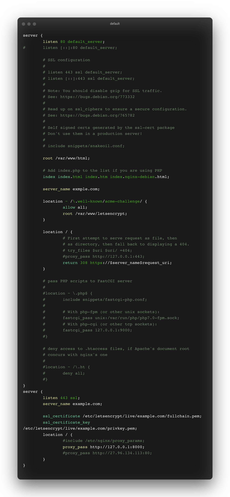

# 배포 및 프록시 서버 적용하기.

## 배포하기!

배포 전략으로 ncloud 서버에 어플리케이션과 DB는 도커 컨테이너를 사용하여 띄우고, nginx를 앞단에 두어 프록시 서버를 통해 서버에 접근하도록 하였습니다.

### Step 1. docker-compose로 이미지만들기.

우선 application과 db를 원격 서버에서 이용할 수 있도록 docker-compose를 세팅하고, application 이미지를 만들어줍니다.

docker-compose를 build하여 app 이미지를 만들어주고, 해당 이미지를 원격 서버에서도 사용할 수 있도록 docker registry에 푸쉬해줍니다.

db는 mongodb를 사용했으며 [docker hub에 image가 존재](https://hub.docker.com/_/mongo)하기 때문에 따로 등록해줄 필요는 없습니다.

### Step 2. ncloud에 docker container 띄우기.

cloud 서비스로 ncloud를 사용하였으며 ssh를 통해 원격서버에 접근하여 container 생성을 위해 docker-compose.yml을 만들어주고 docker registry에 등록하였던 app 이미지를 pull해옵니다.

docker-compose up -d 로 이미지를 빌드하고 컨테이너를 생성합니다.

### Step 3. nginx로 프록시 서버 세팅하기.

원격 서버에 nginx를 설치하고 설정 파일에서 지정한 domain으로 접근 시 nginx로 접근되도록합니다.

80 port와 443 port를 사용하도록 설정되어있으며 80으로 접근시 443 (https)로 리다이렉트 되도록 설정되어있습니다.

letsencrypt와 certbot을 사용하여 ssl 인증서를 발급받고 https접근을 가능하도록 하였습니다.

