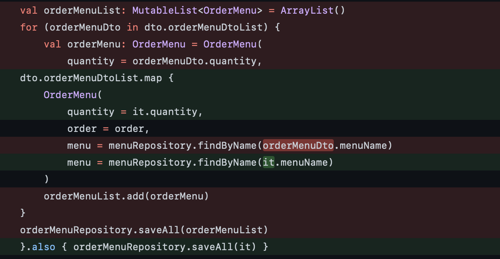

## kotlin collection 관련 함수들을 활용하여 코드를 더 깔끔하게 리팩토링 해보자!

kotlin collection 관련 함수에는 아주 많은 것들이 있으며, 그 중 map을 이용하여 반복문을 사용한 코드를 보다 깔끔하게 리팩토링하였다.

같이 스터디를 하는 스터디원분의 코드 리뷰를 통해 map을 활용하여 코드를 수정해보는 것이 어떻겠냐는 조언을 얻었고 코드를 수정하면서 map을 사용함으로써 얻었던 감정을 기억해보고자, 별거아닐 수 있지만 흔적을 남겨본다.

주어진 상황은 주문 생성 로직이다. 해당 로직은 아래와 같다.

step 1. 가게에서 음식 주문을 받는다.

step 2. 주문 내역을 db에 저장하는 로직을 수행한다.

step 3. 하나의 주문에는 여러개의 orderMenu가 존재하고, 주문에 메뉴들은 list로 받는다. 즉, 각각의 메뉴들을 반복문으로 조회하여 하나 씩 order_menu table(db)에 저장해준다.

해당 로직의 삭제된 코드와 추가된 코드는 아래와 같다.

코틀린에서는 람다 표현식에서 단일 매개변수의 이름을 it으로 부르기로 약속되어있다.

map함수를 적용함으로써, 코드도 간결해지고, 이해도 직관적으로 잘되는 코드가 되었다.

새로운 언어(코틀린)을 익히면서 아직 스프링도 계속해서 깊이를 더해가고 있는 상황이기 때문에 기본적인 구문으로 구현이 된다면 굳이 같은 기능을 하는 함수등을 찾아보고 코드의 질을 더 높이려는 시도는 하지 않았다.(못했다..?)근데 이번 스터디에서 로직 및 코드의 개선에 대한 의견을 받으면서, 앞으로 더 공부하고 발전해야할 요소들이 많구나 하는 생각을 했다. :)