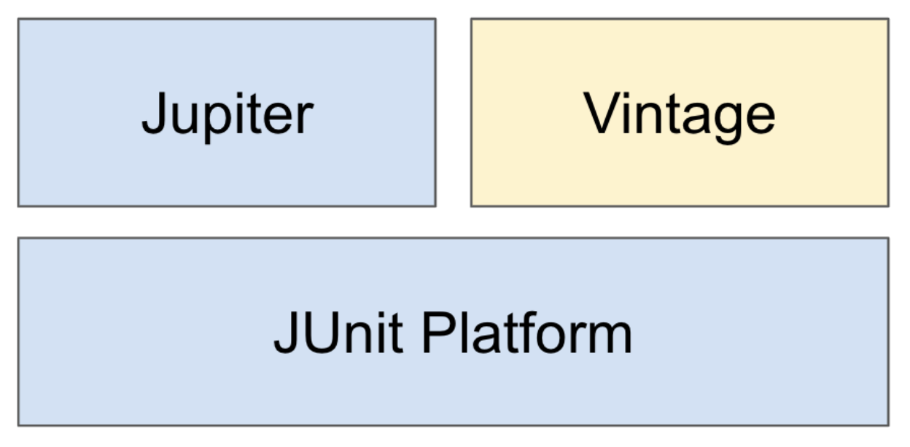

# JUnit 5

본 내용은 백기선님의 ‘더 자바, 애플리케이션을 테스트하는 다양한 방법’을 정리한 글입니다.

## JUnit 5

자바 개발자가 가장 많이 사용하는 테스팅 프레임워크.

JUnit 5 는 모듈화가 되어있다.

Platform:  테스트를 실행해주는 런처 제공. TestEngine API 제공.

Jupiter: TestEngine API 구현체로 JUnit 5를 제공.

Vintage: JUnit 4와 3을 지원하는 TestEngine 구현체.

JUnit만의 플랫폼이 존재하기 때문에(모듈화와 별개의 얘기로) 일반적으로 자바에서는 main 으로 선언된 메소드에서만 실행이 가능하지만 JUnit은 @Test 어노테이션이 붙은 메소드 단위로 실행이 가능하다.

---

### JUnit5에서 제공하는 어노테이션들

@Test

- 해당 어노테이션이 붙은 메소드는 하나의 테스트 단위가 된다.
- JUnit4에서는 public을 붙여줘야 했지만, Junit 5에서는 붙여주지 않아도 되며 반환값이 없다.

@BeforeAll

- 해당 어노테이션이 붙은 메소드는 모든 테스트가 실행되기 전에 한번만 실행된다.
- static
- return값 x (void)

@AfterAll

- 해당 어노테이션이 붙은 메소드는 모든 테스트가 실행된 후 한번만 실행된다.
- BeforeAll과 마찬가지로 static void

@BeforeEach

- 해당 어노테이션이 붙은 메소드는 각 테스트 이전에 반복해서 실행된다.

@AfterEach

- 해당 어노테이션이 붙은 메소드는 각 테스트 이후에 반복해서 실행된다.

@Disabled

- 해당 어노테이션이 붙은 테스트는 실행에서 제외된다.

---

### 테스트 이름 표시하기

@DisplayName

- 어떤 테스트인지 테스트 이름을 보다 쉽게 표현할 수 있는 방법을 제공하는 어노테이션.
- @DisplayNameGeneration 보다 우선 순위가 높다.

@DisplayNameGeneration

- 테스트 메소드명을 해당 어노테이션의 표기 방법으로 이름을 바꿔서 보여준다.
- Method와 Class 레퍼런스를 사용해서 테스트 이름을 표기하는 방법 설정.
- 기본 구현체로 ReplaceUnderscores(언더바를 공백으로 바꿔서 표기) 제공

---

### Assertion

org.junit.jupiter.api.Assertions.*

| 실제 값이 기대한 값과 같은지 확인 | assertEquals(expected, actual) |
| --- | --- |
| 값이 null이 아닌지 확인 | assertNotNull(actual) |
| 다음 조건이 참(true)인지 확인 | assertTrue(boolean) |
| 모든 확인 구문 확인 | assertAll(executables...) |
| 예외 발생 확인 | assertThrows(expectedType, executable) |
| 특정 시간 안에 실행이 완료되는지 확인 | assertTimeout(duration, executable) |

마지막 매개변수로 Supplier<String 타입의 인스턴스를 람다 형태로 제공할 수 있다.

- 복잡한 메시지 생성해야 하는 경우 사용하면 실패한 경우에만 해당 메시지를 만들게 할 수 있다.

[AssertJ](https://joel-costigliola.github.io/assertj/), [Hemcrest](https://hamcrest.org/JavaHamcrest/), [Truth](https://truth.dev/)등의 라이브러리를 사용할 수도 있다. (springboot-starter-test를 받으면 AssertJ, Hemcrest등도 들어온다.)

assertAll()을 사용하면 모든 assert문을 내부에 excutable 인자로 넣어서 모두 실행시켜볼 수 있다.(만약 assertAll()을 사용하지 않고 여러개의 assert문이 존재할 경우 통과되지 않은 assert문에서 테스트는 종료되어 뒤의 assertion은 확인할 수 없게된다.)

assertTimeout()은 excutable동작이 duration안에 끝나는지를 확인한다.

---

### 특정 조건에서만 테스트 실행하기

가령 환경변수라 로컬버전일 경우에만 테스트 실행.

- assumeTrue (if문 역할)
- assumingThat
  - 2번 째 인자로 람다식으로 테스트 코드를 넣어주어서 첫번째 인자가 만족할 경우에만 해당되는 테스트코드를 실행하도록 할 수 있다.
- @EnabledOs, @DisabledOs 어노테이션을 테스트 메소드에 추가하면 해당 테스트를 실행할 OS를 지정할 수 있다.
- @EnabledJre, @DisabledJre 로 자바 버전 설정도 가능하다.
- @EnabledIfEnvironmentVariable()

---

### 태깅과 필터링

- @Tag 어노테이션을 통해 테스트들을 그룹화 할 수 있다.
- 가령 유닛테스트, 통합 테스트인지 / 테스트까 빠른 테스트인지 느린 테스트인지 ,,
- 그리고 실행할 Tag 네임을 지정.

---

### 커스텀 어노테이션

- 어노테이션을 하나만들어서 @Tag, @Test, 여러 것들을 넣어서 커스텀한 어노테이션을 만들어 사용할 수 있다.
- 이렇게하면 @Tag로 지정한 문자열에 대하여 동일한 것을 사용하게 되기때문에 보다 안전할 것임.

---

### 테스트 반복하기

- 테스트하게되는 어떤 로직의 값이 랜덤이거나, 테스트가 실행되는 타이밍에 따라 결과가 달라질 수 있는 경우 테스트를 반복해서 실행할 필요가 있다.
- @Test대신 @RepeatedTest()를 사용하면 해당 테스트를 반복해서 실행시킬 수 있다.
- @Test대신 @ParameterizedTest(), @ValueSource를 사용하면 테스트 메소드의 인자로 @ValueSource에서 지정한 값들을 넣어주면서 반복해서 실행시킬 수 있다.

---

### 테스트 인스턴스

- 기본전략은 @Test 마다 인스턴스 생성한다.
- 이유 : 테스트간의 의존성을 낮추기위해서
- 의존성을 낮추기 때문에 테스트의 순서 또한 보장되어있지 않을 정도다. (기본적으로 순서대로 실행되게끔 되어있지만)
- class에 @TestInstance(TestInstance.Lifecycle.PER_CLASS)를 적용하면 클래스에 하나의 인스턴스만 생성함.
- 위에서 언급한 어노테이션을 붙이면 @BeforeAll등의 메소드가 static이 아니어도 됨.

---

### 테스트의 순서

- 단위 테스트를 작성하는 경우에는 테스트의 순서를 신경써서는 안된다. (각 테스트간에 의존성이 없어야하기 때문에)
- 하지만 어떠한 시나리오가 있는 테스트, 통합 테스트의 경우에는 코더가 의도한 순서대로 동작해야하는 상황이 있을 수도 있다.
- @TestMethodOrder(OrderAnnotation.~)를 붙여주면, 테스트 메소드에 붙은 @Order에 정의된 순서대로 실행된다.

---

### JUnit 설정 방법

- test/resources/junit-platform.properties 라는 이름으로 파일 생성하고 이 파일에서 설정 가능하다.
- 해당 설정은 모든 테스트에 일괄 적용된다.
  - 테스트 인스턴스 라이프사이클 설정
  - 확장팩 자동 감지 기능
  - @Disabled 무시하고 실행하기
  - 테스트 이름 표기 전략 설정 등

---

### JUnit 5 확장 모델

말그대로 JUnit 5의 기능을 확장 시키는 방법. (커스텀하게도 가능)

JUnit 4의 확장 모델은 여러가지가 있었지만 JUnit 5의 확장 모델은 Extension 하나이다.

등록 방법

- 선언적인 등록 @ExtendWith
- 프로그래밍 등록 @RegisterExtension
- 자동 등록 자바 ServiceLoader 이용

---

### JUnit4를 JUnit5에 마이그레이션

- Junit5의 Vintage 모듈로 실행 가능하다. ( spring boot로 프로젝트로 만들면 기본적으로 exclude되어있어서 gradle에서 설정이 필요하긴하다. )